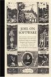

De los dineros que he gastado este mes, mis recomendaciones son:

**The Immortal Iron Fist**, con guiones de **Ed Brubaker** y **Matt Fraction**, arte principalmente de **David Aja** y otros (hay muchos _flashbacks_ a distintas etapas de la historia, cada una por un artista invitado). Me he hecho con los primeros tres tomos, a saber: [The Last Iron Fist Story](http://www.bookdepository.co.uk/book/9780785124894/Immortal-Iron-Fist-1), [The Seven Capital Cities of Heaven](http://www.bookdepository.co.uk/book/9780785125358/The-Immortal-Iron-Fist-2) y [The Book of Iron Fist](http://www.bookdepository.co.uk/book/9780785125365/The-Immortal-Iron-Fist-3). Una media de unos diez euros por tomo con gastos de envío gratuitos en _BookDepository_.

 

También es cierto que los recomiendo con ciertas reservas. El primero es magistral, toda una revisión del personaje perfecta para quien no lo conozca, el segundo ya no es tan bueno, pero ayuda a construir un gran trasfondo de personaje de modo único (separado del resto del Universo Marvel tradicional) y el tercero lo tengo por terminar pero son principalmente números sueltos y especiales fuera de la colección madre, por lo que queda a la elección de cada uno leerlo o pasar de él.

Y como recomendación para los informáticos, dos libros de **Joel Spolsky**: [Joel on Software](http://www.bookdepository.co.uk/book/9781590593899/Joel-on-Software) y [More Joel on Software](http://www.bookdepository.co.uk/book/9781430209874/More-Joel-on-Software). Básicamente son compendios de artículos publicados en su blog, [Joel on Software](http://www.joelonsoftware.com/) (qué casualidad). Estos me acaban de llegar hoy pero ya había leído algunos textos con anterioridad, así que me atrevo a recomendarlos de antemano. Rondando los 16 euros por libro, puestos en casa.

   

¿Quién es este Joel y por qué me deberían interesar sus libros? \[[Wikipedia](http://en.wikipedia.org/wiki/Joel_Spolsky)\] Es el fundador de [Fog Creek Software](http://www.fogcreek.com/), cuyo trabajo más conocido sea probablemente la increíblemente útil página de [Stack Overflow](http://stackoverflow.com/), que sirve para resolver dudas a otros programadores y crearte un currículum en el camino, validado según la opinión de tus semejantes, lo que hace que tu perfil esté pre-validado de cara a futuros empleadores.

De todos modos (que estoy divagando) su fama no viene de ahí, sino de haber creado la empresa en sí misma, una empresa cuya filosofía es: _si haces de esta empresa un lugar donde la gente quiera venir a trabajar, vendrán los mejores profesionales_. Los estándares de trabajo incluyen mesas regulables en altura, sillas ergonómicas de 900$, dos monitores por persona (30 y/o 21 pulgadas cada uno), cuenta libre en Amazon para encargar libros técnicos para la biblioteca, y zonas comunes como salón con televisión de plasma o cocina con una cafetera de verdad... como las de los mejores bares. Dan de comer cada día a todos los trabajadores, y la mayoría de ellos tiene oficina privada con ventanas al mundo real (y sigo hablando de programadores). Nunca han aceptado inversores externos, sino que han crecido exclusivamente con los beneficios que dan sus propios productos. Básicamente, ha creado la empresa en la que cualquier ingeniero querría trabajar. Y además sus opiniones suelen estar bien fundamentadas, así que vale la pena leerlas.