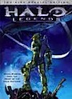
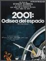
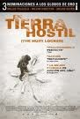

**[Halo: Legends](http://www.imdb.com/title/tt1480660/)** (2010)

Ocho cortos ambientados en el universo de los videojuegos _Halo_, teóricamente siguiendo la moda de _Matrix_ con su _Dvd_ _Animatrix_. El problema básico es que los cortos son horrendos, tanto argumental como técnicamente. Quince euros tirados a la basura.

**[2001: Una odisea del espacio](http://www.imdb.com/title/tt0062622/)** (_2001: A Space Odyssey_, 1968) **revisionado**

Hace mucho tiempo, cuando la vi por primera vez, me pareció una obra hermosa y poética. Hoy me aburre, me parece una soberana tontería y soy incapaz de verla entera de un tirón. No entiendo de cine y ya no estoy para perder el tiempo viendo tomas de diez minutos de una nave espacial estática con un vals de fondo.

**[En tierra hostil](http://www.imdb.com/title/tt0887912/)** (_The Hurt Locker_, 2008)

En la _imdb_ pone 2008, pero aún sigue en cines. Sorprendente. Apenas estaba en una única sala con horarios extraños en los cines que me pillan más a mano, y los recientes _Oscars_ han conseguido que vuelva a estar de moda. Gracias a eso he podido verla, porque ya se estaba haciendo difícil encontrar un pase a horas normales.

Pensaba escribir un único post con el título "_**El día que descubrí que no entiendo de cine**_", pero para qué. Me ha parecido una tomadura de pelo. Hay tres personajes sin el menor tratamiento. Los secundarios sólo son extras que aparecen y, como Internet, tal y como vienen se van. _Evangeline Lilly, Ralph Fiennes, Guy Pierce, David Morse_... vienen, tienen dos frases, y desaparecen para no volver. No hay ninguna historia ni ninguna evolución de los personajes en ninguna dirección, y es que esto podría entrar (como mucho) en la categoría de _slice of life_, de historia costumbrista en la que te cuentan un episodio de la vida de alguien, sin introducción, nudo, ni desenlace ninguno. Y si me apuras lo catalogaría más como documental que como película.

El uso de la cámara parece el de un usuario "doméstico"... movimiento constante, uso indiscriminado de un _zoom_ demasiado rápido, abuso de los primeros planos incluso en escenas de acción. Mi reino por una _steady-cam_ en algún momento de la película. A la mitad del metraje tuve que taparme los ojos deseando que terminara, porque el mareo era insoportable. Mareo físico, real, no es una metáfora.

De todas las nominadas a mejor película este año, he visto con anterioridad _Avatar, Distrito 9, Malditos Bastardos, Up_ y _Up in the air_. Todas me parecieron películas mejores. Incluso la de _Tarantino_ que me pareció inaguantable.

No entiendo de cine, está claro.