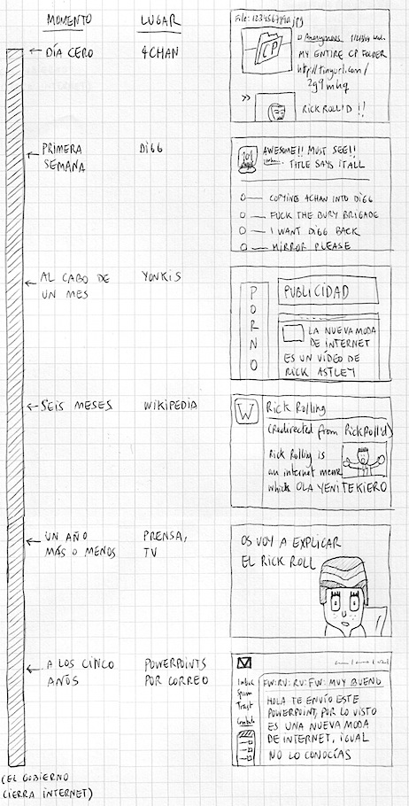

Una tira de [Dame la voz](http://blog.damelavoz.es/evolucion-de-las-chorradas-en-internet/) que he encontrado en [Pisito en Madrid](http://www.pisitoenmadrid.com/blog/2009/10/la-vida-circular-de-internet/). Es la explicación perfecta de por qué tantas veces acabo respondiendo a todo el mundo: "sí, ya lo había visto". Simplemente porque vivo en un "segmento de usuarios distinto", no es por ganas de ir haciéndome el listo (que también).

Es perfectamente aplicable a ese otro gran misterio del mundo: en este país todas las agencias de publicidad tienen una creatividad que roza el cero absoluto, y prácticamente todos los anuncios de televisión que parecen mínimamente originales son copias de vídeos que se hicieron famosos en internet un año antes.
