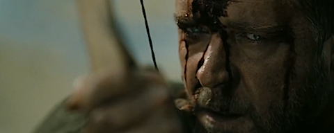
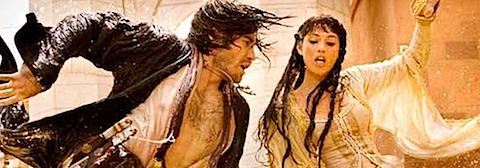
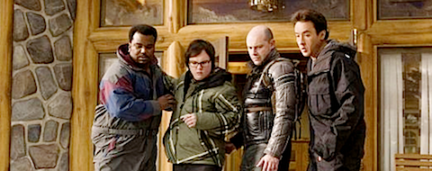
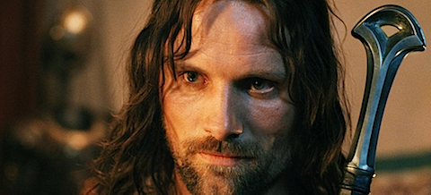
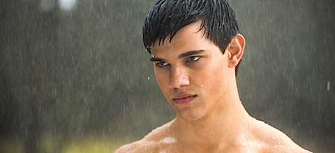

  

**[Robin Hood](http://www.imdb.com/title/tt0955308/)** (2010): Épica muy, muy sencilla. Históricamente muy poco creíble (¡barcazas de desembarco!) y excesivamente alejada del concepto que todos tenemos del personaje. Y es que igual que se ha titulado _Robin Hood_ podía haberse titulado "_El caballero de la brillante armadura_" o "_El soldado y la dama_" o cualquier otra tontería. Por lo demás mantiene el tipo como buenamente puede hasta su último cuarto de hora, donde un par de incoherencias argumentales destruyen lo poco que teníamos hasta ese momento. Específicamente el hecho de que hay cierto secreto mantenido que, de repente, todo el mundo conoce, y nadie nos explica cómo se ha conocido. Por supuesto el aparentemente necesario momento feminista de _Cate Blanchett_ liderando a los niños perdidos, perdón, a los niños del bosque, rompe todo viso de credibilidad. No la recomiendo.  

  

**[Prince of Persia: Las arenas olvidadas](http://www.imdb.com/title/tt0473075/)** (_Prince of Persia: The sands of time_, 2010): De esto [ya hablé hace poco](https://neverbot.com/cine/prince-of-persia-las-arenas-olvidadas/). De lo peor que he tenido la desgracia de ver últimamente, aunque hay quienes dicen que la película tiene sus virtudes. Ya digo que yo no las encontré.

**[Jacuzzi al pasado](http://www.imdb.com/title/tt1231587/)** (_Hot Tub Time Machine_, 2010): Tengo mi excusa, no pude entrar a la película que quería ver por un desencuentro con la dirección del cine (que ya explicaré en otra ocasión), y cuando me iba refunfuñando a mi casa me encontré con unos amigos que iban a ver esto. Tenía que explicarlo porque si no destruyo la poca imagen que me queda.

Tiene sus momentos graciosos, claro, y todas las películas de _John Cusack_ tienen algo por lo que verlas (es uno de mis axiomas cinematográficos), y de cuando en cuando aparece _Chevy Chase_. Pero en ocasiones se pasa de escatológica y tiene un final absurdo incluso para el género. Vale para ver con amigos descargada de internet, y poco más. Por lo menos no engaña al personal, sólo con el título ya sabes claramente lo que vas a ver.

**[El señor de los anillos: El retorno del Rey](http://www.imdb.com/title/tt0167260/)** (_The Lord of the Rings: The Return of the King_, 2003, **revisionado**): Volví a verla una noche que me quedé de Rodríguez y no tenía nada mejor que ver. Tras varios visionados a lo largo de los últimos años, y aún contando con que soy un público muy freak a quien debería gustar, voy a lanzarme a la piscina con: _esta trilogía está muy sobreestimada_. Y no está envejeciendo bien. Hay muchas escenas en las que los efectos apestan, y se hace innecesariamente larga, además de sufrir el efecto "_Salvad al soldado Ryan_" de tener la acción demasiado pronto y tener que alargar mucho con situaciones que ya no son tan interesantes y rompen el ritmo.

Aunque también he de decir que yo sólo tengo las ediciones extendidas, esto quizá no pase tanto con las normales, y en ellas no notes como espectador que todo se alarga innecesariamente hasta encontrarte mirando el reloj pidiendo que todo termine ya.

  

**[Luna nueva](http://www.imdb.com/title/tt1259571/)** (_New Moon_, 2009). Sigue en la línea de la anterior. Los defectos principales siguen siendo los mismos: la total descontextualización de los mitos y el excesivo edulcorante. El mito en sí no me preocupa, porque también soy capaz de disfrutar con los vampiros con armas automáticas de _UnderWorld_. El edulcorante, teniendo en cuenta que soy espectador habitual de comedia romántica, podría ser aceptable... aunque aquí roza constantemente la automasturbación ("_sin ti no podría vivir_", "_tu presencia me da la vida_", y demás lindezas), y eso la hace cuesta arriba, aunque explica claramente las razones de su triunfo entre la hormonada chavalería.

El único momento insultante es el de terminar con un _cliffhanger_ sin cerrar un arco narrativo claro, más en la línea de un episodio de televisión que de una película. Desconozco si los libros siguen ese patrón (ni me importa), pero estoy muy cansado de verlo aplicado en cine, donde considero que si tengo que pagar un dinero para entrar a la sala, me deberían ofrecer una obra completa y entendible por sí misma.

Y por supuesto yo estoy con los lobos, no con esa panda de amanerados de piel brillante.