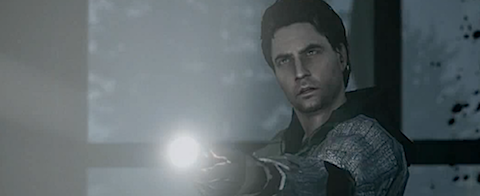

Tiene todos los defectos que se le pueden achacar a los videojuegos modernos e incluso alguno más. A saber: es corto, es sencillo y es repetitivo.

*   Es **corto** probablemente por imperativo de la productora, ya que el juego se había retrasado repetidas veces y ya estaba costando demasiado. Estamos hablando de unas ¿8 horas? de juego, a lo sumo.
*   Es **sencillo**, **\[explicado en los comentarios\]** aún contando con que el modo de juego es bastante original, sumando el uso de la luz al uso de las armas que tenga disponibles el protagonista. Una vez aprendido este modo de juego después de los primeros minutos, no encontraremos grandes retos a superar. Sí hay zonas más complicadas y zonas más sencillas, pero todas siguen patrones similares, y son fácilmente superables. Por descontado que es otro de esos juegos estilo "_si corres puedes evitar a casi todos_".
*   Es **repetitivo**, las mecánicas son siempre las mismas. Camina por el bosque, enfréntate a enemigos, llega hasta alguna zona iluminada. Repetir. Pocas zonas se salen de esta mecánica.

E incluye otro error más: **no termina**. O al menos no del todo, pero esto es difícil de explicar **sin _spoilers_**. Sí es cierto que incluye un posible final, pero la historia está claramente preparada para continuar en forma episódica, tal y como se va desarrollando el propio juego. Los "_niveles_", si podemos llamarlos de tal modo, están construidos como capítulos de una novela, o de un serial televisivo, con sus propias introducciones con un "_**anteriormente, en Alan Wake...**_". Y todos terminan con magistrales canciones a modo de créditos. Cuando llega el final del último capítulo incluido en el juego, la impresión del jugador es que esto claramente puede continuar. De hecho, el primer contenido descargable está a punto de salir al mercado, gratuito para los compradores del juego original, pero ya hay al menos otros dos contenidos planeados y con fecha de salida. Es decir... ¿en alguno de esos terminará la historia? ¿o tendré que seguir pagando indefinidamente?

**Bajo estas premisas, ¿recomendaría el juego? Rotundamente sí.** Y es que, a falta de una palabra mejor, el acabado del juego es magistral. La ambientación, la música, la integración de la narrativa interactiva con la cinematográfica, la voz en _off_, todo está donde debe estar y cuando debe estar, y pese a haber utilizado mecánicas en su mayor parte repetitivas (exceptuando alguna fase con vehículos), al terminar el juego sólo queda el buen sabor de boca de haber participado de una historia entretenida y bien construida (al menos para el estándar del medio). Lástima del final en falso, que habría terminado de hacer un juego redondo. Por mi parte es el juego que más he disfrutado en lo que va de año.

Recomendación: esperar a una edición _game of the year_ que incluya los contenidos descargables en el propio _dvd_. Claro que si todos esperamos a eso quizá el juego no llegue a ser _game of the year_.

> **Actualizado: puntualizo en los comentarios el tema de la dificultad**, ya que a mí en particular no me parece realmente que el hecho de ser relativamente sencillo sea un defecto.