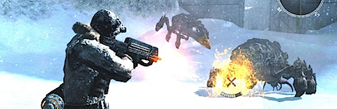

**Bleg**. Lo compré en un impulso, porque me gustó la demo _online_ de _XBox Live_. Pero yo no juego _online_, y el modo de un único jugador es inaguantable. Tras unas horas de juego **lo dejé aparcado... hace dos o tres años al menos**, y me he animado a terminarlo esta última semana (estoy siguiendo un plan intensivo de terminar los juegos comprados antes de adquirir ninguno nuevo).

**Repetitivo** (en el mal sentido, si al menos se estuviera repitiendo algo divertido...)**, insulso, y aburrido**. Trata de actualizar el modo de juego de los ochenta, de niveles sencillos de mecánicas simples seguidos de un enemigo final tremendamente difícil, lo que hace que la mecánica a seguir sea la de jugar un nivel durante media hora, y repetir enfrentamientos contra ese enemigo final durante una hora, una y otra vez, hasta que lo consigues o tiras el mando por la ventana. Repetir durante las aproximadamente **diez u once horas** que puede dar de sí.

**Técnicamente el juego no es brillante**, con colisiones mal calculadas y enemigos que en ocasiones atraviesan paredes, jefes finales cuyas mecánicas de enfrentamiento son cualquier cosa menos obvias, y en ocasiones con objetivos a los que es difícil disparar (porque atraviesan las mallas y se meten bajo tierra, por ejemplo).

**Narrativamente... es una desgracia**. Uno de esos intentos orientales de ciencia ficción de anime barato. Personajes y situaciones sin sentido, traiciones de gente que acaba de aparecer y muertes de personajes que no le importan a nadie, incluyendo amnesias que van y vienen. Vídeos largos y mal integrados con el juego, diseños de personajes estrafalarios _a la Final Fantasy_ y una historia que, básicamente, apenas se comprende (aunque mi pausa de años entre medias quizá no haya ayudado).

Como apunte a pie de página, añadiré que además **el juego no es fácil**. La vida del personaje está constantemente cayendo, incluso aunque no hagas nada, para reflejar el efecto del frío perpetuo en el planeta helado. Queda claro que eso, desde luego, no ayuda a facilitar la tarea. Si al menos os gustan los retos puede ser el punto positivo que encontréis en él. Si preferís los juegos de dificultad moderada, y simplemente disfrutar con el viaje, no es para vosotros.

Me pregunto cómo ha sido capaz de generar una continuación. **Deja pasar el juego y no te acerques a él.**
