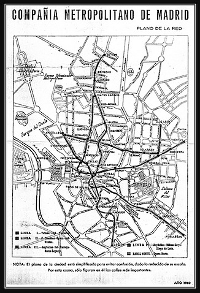

_Metro de Madrid en 1960, (cc)_ [_Antramir_](http://www.flickr.com/photos/antramir/2247967725/) {.center}

Con un carril bici que sólo sirve para pasear por parques, y un transporte público que tarda una hora en llevarte al centro (de mi casa al trabajo sería más de hora y media), y que hace huelgas sin servicios mínimos, el único resultado posible es utilizar el transporte privado.

**O puedes dejar de votarles de una vez.**

