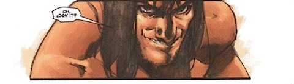

Si tenemos en cuenta que mi conocimiento del _Conan_ literario es escaso, y del _Conan_ comiquero era nulo, confié en las reseñas originales de cuando se comenzó a publicar esta nueva colección, hace ya cinco años, que la recomendaban como un perfecto punto de enganche para nuevos lectores. Nuevo guionista (_Kurt Busiek_), de demostrada solvencia, aunque arriesgándose en un nuevo género, y un dibujante (_Cary Nord_) novel pero de calidad, y con un estilo actual alejado de la usual sobrecarga que suele acarrear el género.  

Y así era. El punto de enganche es ignorar todo lo existente previamente de _Conan_ en cómic, ignorar todo lo existente en libro que no fuera lo escrito originalmente por _Robert E. Howard_ (al contrario que los cómics anteriores, que bebían de múltiples escritores), y un comienzo cronológico, desde que un joven _Conan_ de apenas dieciséis años abandona _Cimmeria_ para conocer el ancho mundo. Fantástico para un neófito como yo.

Editados en España por _cómics forum_ (el ya casi extinto sello de _Planeta DeAgostini Comics_) con el título de _Conan: La Leyenda_, comprendiendo los números desde el cero hasta el veintiocho de la colección (de un total de cuarenta).

El resultado es muy bueno, historias interesantes, una presentación de las naciones y sus gentes progresiva y acertada, e historias nuevas intercaladas con adaptaciones de los relatos originales, como _El dios del cuenco_ o _La torre del elefante_. Y de cuando en cuanto algún número suelto con otro dibujante, narrando la infancia del protagonista. Exceptuando esos escasos números, la mayor parte de la colección está dibujada por _Cary Nord_, con pocos números llevados por otros artistas, lo que ayuda a dar una imagen de consistencia, apoyada por un grafismo a lápiz, sin tinta, y excepcionalmente coloreado por el ganador de múltiples premios _Dave Stewart_. Precisamente esa falta de entintado le da en ocasiones fuerza a la narración, aunque en otros momentos (los menos) algunas viñetas quedan excesivamente desdibujadas, como si la página se hubiera realizado a toda prisa.

**En cualquier caso, muy recomendables.**

A partir de aquí os lo puedo resumir aunque no los he leído: vinieron un par guionistas y posteriormente cambió también el dibujante, a lo que acompañó una desastrosa edición por parte de _Planeta_ en España, con cambios de periodicidad, desapariciones temporales de la colección, números dobles, triples, y hasta un último número cuarenta en grapa... costando diez euros. Al finalizar esa etapa, coincidiendo con un avance argumental en el propio protagonista, comienza _Conan: El Cimmerio_, con un carácter ciertamente continuista manteniendo el guionista y dibujante que venían de la anterior colección. Nuevamente, aquí _Planeta_ se luce, publicando tebeos en grapa de veinticuatro páginas a tres euros (mismos precios con los que edita los cómics _DC_, y explica por qué no les compro nada). Quizá me anime a continuar a partir de _Busiek_ pero, en cualquier caso, será con ediciones en inglés, y no con las ediciones que está haciendo _Planeta_. Se admiten recomendaciones al respecto, por supuesto.