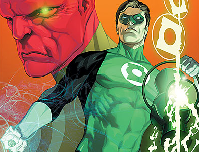

Séptimo tomo recopilatorio desde la vuelta de _Hal Jordan_ como Linterna, a saber: [Rebirth](http://www.bookdepository.co.uk/book/9781848567658/Green-Lantern-Rebirth), [No Fear](http://www.bookdepository.co.uk/book/9781401210588/No-Fear), [Revenge of the Green Lanterns](http://www.bookdepository.co.uk/book/9781401209605/Revenge-of-the-Green-Lantern), [Wanted: Hal Jordan](http://www.bookdepository.co.uk/book/9781401215903/Wanted-Hal-Jordan), [The Sinestro Corps War](http://www.bookdepository.co.uk/book/9781845767839/Green-Lantern-Sinestro-Corps-War-v.-1) (en [dos tomos](http://www.bookdepository.co.uk/book/9781845768799/Green-Lantern-Sinestro-Corps-War-v.-2)) y ahora [Secret Origin](http://www.bookdepository.co.uk/book/9781848560727/Green-Lantern-Secret-Origin). \[Enlaces a BookDepository\].

_Rebirth/Renacimiento_ fue un perfecto punto de enganche a un personaje clásico de DC que vuelve a ser nuevo, tras muchos (muchos) años desaparecido de las primeras filas de los personajes importantes, cuando la muerte significaba algo. Al menos algo más que ahora, donde nadie permanece muerto más de doce meses en ninguna colección _mainstream_.  

> Resumiendo para quien no conozca al personaje, los _Green Lanterns_ son un cuerpo policial intergaláctico, a quienes se concede un anillo de poder capaz de crear en una poderosa luz verde cualquier cosa que su portador imagine. Por tanto, su poder depende directamente de su fuerza de voluntad y de su capacidad para evitar el miedo. _Hal Jordan_ acaba recibiendo, más por casualidad que otra cosa, uno de estos anillos y se convierte en el protector de nuestro sector de la galaxia (que incluye más cosas que la tierra, por supuesto). Bla, bla, bla, todo poder conlleva una responsabilidad, al hombre se le acaba yendo un poco la cabeza y acaba con todos los demás _Green Lanterns_, convirtiéndose en una amenaza para toda la existencia (con el nombre de _Parallax_). Como no podía ser de otra manera, acaba siendo vencido.
> 
> Algunos otros personajes menores vuelven a ser _Green Lanterns_ poco a poco, el espíritu de _Hal Jordan_ vaga por el universo (eso sería otro tema) y después de muchos años a _Geoff Johns_ se le encarga guionizar la colección y decide que el _Green Lantern_ de cuando él era un chaval era _Hal Jordan_ y, por tanto, hay que traerlo de vuelta. Fin del resumen.

Tras los seis primeros tomos (cinco arcos argumentales), el guionista se desmarca con este _Secret Origin_, que perfectamente podría haberse titulado _Año uno_, ya que vuelve a narrarnos el origen del personaje, con dos excusas: La primera, dar de nuevo un punto de enganche a la colección a los nuevos lectores, tras las buenas críticas que los anteriores arcos estaban cosechando. La segunda: al igual que en esos anteriores arcos, ir dejando colgados pequeños detalles para la gran traca final que será _Blackest Night_, el objetivo argumental de todo este tinglado. Por supuesto, en este tomo esto se consigue a través de pequeños cambios en la "retrocontinuidad", mostrando cosas que nadie "sabía", pero haciéndolo de un modo elegante y sin cambiar ninguno de los detalles importantes que conforman al personaje.

Se nos muestra el momento en que _Hal_ consigue el anillo, su viaje a _Oa_ y su formación primigenia como _Green Lantern_ y su primer encuentro con un _Sinestro_ aliado, así como la historia de su vida familiar y privada. Todo contando con un gran arte por parte de _Ivan Reis_. **Recomendable: absolutamente.**

> **Pensamientos laterales acerca del personaje y la futura película:**
> 
> Se está rodando la película basada en él, pero lo veo todo envuelto en las brumas de la imposibilidad cinematográfica. Encontraremos el mismo problema que al trasladar _Superman_ al cine, todo lo que rodea a _Hal_ es demasiado grande, demasiado poderoso y demasiado rápido. La escala de las historias es inabarcable para una película, y no hay enemigo "real" que este _Green Lantern_ no pueda vencer sin sentir que las cosas se nos están yendo de las manos. Es el personaje más imaginativo por definición, ya que su anillo puede crear lo que se le ocurra, desde un avión hasta un planeta, un monopatín, un guante de boxeo o un láser de alta precisión. No me parece que esto se pueda mostrar en pantalla con un mínimo de credibilidad sin quedar risible.
> 
> Y, por supuesto, el detalle de las caracterizaciones. El personaje lleva un pijama verde. _Sinestro_ ([imágenes](http://www.google.es/images?q=sinestro)) es un tipo de color rosa con el bigote de _Errol Flynn_. Y si hablamos de _Tomar Re_ ([imágenes](http://www.google.es/images?q=tomar+re)), otro de los linternas colaboradores de _Hal_... es un humanoide con orejas puntiagudas, pico de ave y una cresta reptiloide. Estas cosas pertenecen al papel, son imposibles de trasladar a la pantalla sin que el mundo se ría de ellas... y sin embargo parece ser que están intentando hacerlas fieles.