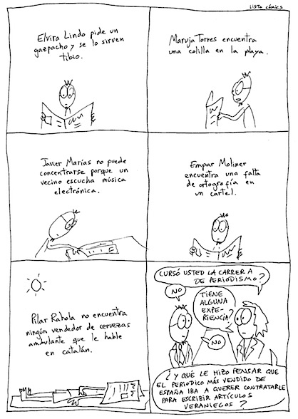

Vía [Listonauta](http://listo.tumblr.com/post/989235306/verano).

Opinión gratuita: Lo triste es que _El País Semanal_ (el suplemento dominical de _El País_) es así todas las semanas, no únicamente durante el verano. Lo que antes eran columnas de opinión ahora se han convertido en los _blogs_ personales de media docena de escritores, conformando una revista soporífera. Alguien podría decirles a esta gente que se abrieran un _blog_ para escribir las tonterías sobre su vida privada, que gastaran sus necesidades exhibicionistas en casa, y fueran así capaces de escribir artículos de opinión sobre temas que pudieran interesar a algún otro mortal. Porque para escribir las mongoladas que pueden leerse cualquier domingo vale cualquier _blog_ de medio pelo, como este, por ejemplo.