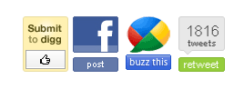

Últimamente tengo la sensación de que **el concepto de "conversación" en Internet está tremendamente sobrevalorado**. Los comentarios de los _blogs_ generalmente no existen o no aportan nada.

Si el _blog_ es pequeño, o incluso insignificante, como este, los comentarios apenas tienen sentido. En **[neverbot.com](https://neverbot.com/)** recibo bastantes comentarios de _hoygans_ perdidos, en entradas de hace meses, que no vienen a cuento, no añaden información ni preguntan nada. Suelo borrarlos, aunque de vez en cuando dejo alguno, aunque sólo sea porque me haya hecho gracia.

Por otra parte, los escasos comentarios que podrían dar lugar a algo suelen ser de los parroquianos habituales, con quienes ya tengo contacto por otros medios o incluso en el mundo real ([aunque tenga poca utilidad](https://neverbot.com/mundo-real%e2%84%a2/la-nueva-forma-de-conversacion/)). Aparte de estos, aquellos pocos que tienen contenido, que me añaden algo de información, y que dan (o puedan dar) lugar a una mínima conversación son un porcentaje mínimo de una población total de comentarios ya de por sí pequeña. Casualmente suelen estar siempre en los _posts_ que muestran opiniones más controvertidas, que aquí son los menos y me da pereza sólo de pensar en escribirlos.

Es decir, que perfectamente podría cerrar el sistema de comentarios y no habría ninguna pérdida. De cualquier modo, los que yo recibo suelen ser comentarios cortos que (me) añaden poca información, por lo que igualmente podrían ser un [tweet](http://twitter.com/neverbot), así que la poca interacción y _feedback_ que recibo de los lectores no creo que se viese afectada.

**¿Y en los blogs grandes?** Hay un tamaño a partir del cual una página web supera una masa crítica determinada y empieza a recibir comentarios como si no hubiera mañana. A partir de ahí hay tres opciones:

*   _Cerrar los comentarios:_ La opción diva.
*   _No hacer nada_: la opción de dejar que los trogloditas digan lo que quieran, como suele suceder en las páginas web de los periódicos. Un caos de analfabetos escribiendo barbaridades sin sentido.
*   _Intentar moderar_, bien sea a mano, con administradores o mediante sistemas colectivos (karma y similares).

La segunda opción es abominable. Yo me la planteo como un experimento a nivel global para probar si el proceso de los _infinitos monos golpeando infinitos teclados_ llega a producir _Hamlet_. No parece un experimento concluyente por ahora. La tercera me parece un gasto de tiempo y dinero (bien sea propio o de otros) que no va a ninguna parte. En serio, si alguien quisiera contarte algo realmente interesante te mandaría un _tweet_ (yo lo suelo hacer con absolutos desconocidos), un email (_so nineties_) o, el más difícil todavía, escribiría algo en su propia página.  

> **Inciso**: Si no tiene página propia será porque quizá considera que no tiene nada interesante que contarle al mundo y/o no tiene ganas de hacerlo. ¿Debería tener ganas de comentar? Naturalmente esto no es así, no es más que otra muestra del 90/9/1. De cada 100 visitantes, noventa sólo leerán, nueve pueden querer comentar algo, y quizá uno quiera crear su propio contenido. Mi experiencia personal dice que realmente ese primer noventa debería ser un 99.

Por lo tanto me parece lógico que muchas páginas opten por cerrar los comentarios y dejarse de pamplinas.

Porque seamos serios, una conversación _blogger_-comentarista no es de igual a igual. Tú tienes una identidad virtual (con nombre real o apodo, es igual) que ha llevado un tiempo construir. Un comentarista pone un _nick_ y dice lo que le parece. Sus palabras y sus opiniones, por estúpidas, inteligentes o temerarias que sean... se las lleva el viento. Quedan en una página extraña, ajena al propio comentarista. La bidireccionalidad no tiene la misma fuerza en ambos sentidos.

Por no hablar de la falta de conversación real. ¿Cuántos de todos los comentaristas leen los mensajes previos? El texto de los demás se diluye, y al final todos los comentarios son poco más que pequeños telegramas con un origen y un destino más o menos claros, pero donde nadie más presta atención ni participa, aunque todos seamos parte del engaño de que estamos teniendo una conversación.

Eso si no nos encontramos con la ruptura total de la bidireccionalidad, con todos esos botones de _me gusta, digg it, tweet this, menéame, facebook_, etc... Toda la interacción y toda la conversación con tu lector es conseguir que pulse un botón. Que no piense mucho y que no muestre su parecer intentando verbalizar algo. Con que ayude a repartir tu mensaje alimentando tu ego nos basta. Que está bien, oye, pero no es una conversación.

**¿Y por qué se plantea esto alguien que apenas recibe comentarios?** Porque estoy dejando de participar en el amago de conversación de otras páginas. Cada vez me cuesta más dejar comentarios en otros blogs o participar en foros (a estas alturas todavía te piden que te des de alta en algo, inconcebible). La tecnología no está de nuestra parte, y creo que hay un gran vacío en cuanto a medios que centralicen conversaciones y ayuden a que el sistema crezca.

Si dejas un mensaje en un _blog_ ajeno, tienes que acordarte de dónde lo escribiste. Añadir un marcador en algún sitio, seguir un _rss_, o algo similar. ¿No sería más fácil que el propio acto de escribir un comentario avisase a tu propia página y que esta sirviera como "centralita" de todas tus conversaciones distribuidas? Eso era en lo que yo creía que se convertiría _Google Wave_, pero con tanto anormal pensando que era una red social, y tanto gurú del carajo vendiendo humo, no pudo ser. Aunque la tecnología era perfectamente válida para eso.

**¿Y todo este palabrerío gratuito a qué viene?** A nada, son los temas en los que estaba pensando. A _Internet_ (así, en general) le falta aún un hervor de usabilidad, y a la humanidad experiencia en cómo compartir información y no sólo transmitirla. Supongo que lo mejor está aún por venir.