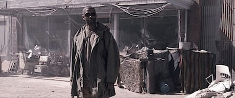
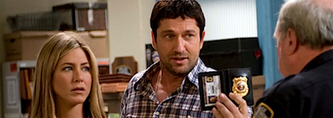
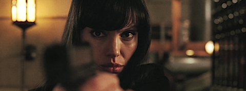
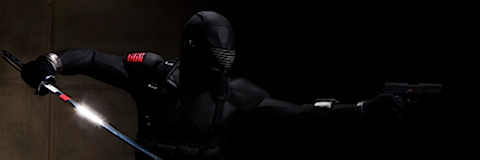
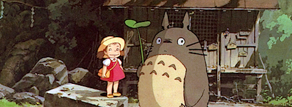
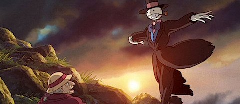
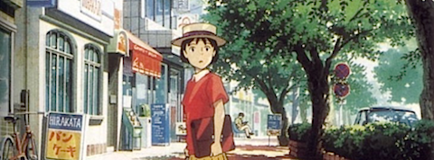

  

**[El libro de Eli](http://www.imdb.com/title/tt1037705/)** (_The book of Eli_, 2010)

Es una pena, porque algo decente podía haber salido de aquí, pero se queda en una película de relleno sin mucha chicha. _Denzel Washington_ al menos está algo contenido con respecto a sus últimos papeles, en los que se interpretaba a sí mismo, pero la historia no tiene misterio y es bastante difícil de asumir. Quizá la incredulidad no se llega a disipar nunca durante el metraje, a lo que no ayudan algunas escenas (pocas) de acción donde el protagonista parece un superhombre con sentidos aumentados. Prescindible. Seguramente en novela la historia sería mucho mejor pero, en contra de lo que yo creía, no existe una novela anterior y es un guión original. Ver para creer, porque hoy en día ya no existen guiones originales en las películas de alto presupuesto.

  

**[Exposados](http://www.imdb.com/title/tt1038919/)** (_The bounty hunter_, 2010)

No tiene absolutamente nada por lo que merezca ser reseñada. Pasad de ella.

  

**[Salt](http://www.imdb.com/title/tt0944835/)** (2010)

Hay quienes la han puntuado mucho mejor de lo que yo voy a hacer, porque le he visto demasiados huecos en el argumento como para pensar que es una obra seria. Sí es cierto que tiene sus virtudes, entre ellas algunos efectos-de-esos-que-no-parecen-efectos bastante reseñables: por ejemplo, si hay una toma con los jardines de la _Casa Blanca_ repletos de camiones de bomberos, puedes dar por seguro que no han "alquilado" el lugar para rodar, sino que todo está colocado por ordenador. Sin embargo otros cantan demasiado, como cuando vemos a _Angelina Jolie_ saltar sobre los techos de varios camiones en marcha y la escena sólo transmite vergüenza ajena.

Por otro lado la historia no tiene por dónde cogerse, ya que los personajes llevan a cabo sus tareas orquestadas sin razón alguna (imposible entrar en esto sin _spoilers_, claro); "el malo" se ve venir desde treinta minutos antes y en la escena final sólo puedes preguntarte cómo ha llegado hasta allí sin ningún permiso de acceso. Y como esa pregunta otra decena durante todo el metraje. Sin entrar en esos _espoilers_, sólo sabiendo que la duda de la película es averiguar si la protagonista está en un bando o en otro, hay cierto punto a mitad del metraje (el barco) a partir del cual ya no tiene sentido que haga absolutamente nada de lo que hace tanto si está de un lado como si está del otro. ¿Por qué continúa la película?

**[G.I.Joe](http://www.imdb.com/title/tt1046173/)** (_G.I.Joe: The rise of Cobra_, 2009) **revisionado**

Ya hablé de ella [en su momento](https://neverbot.com/resenas-cinematograficas-relampago/), cuando la vi en cine, y me sigue gustando. Un poco menos que antes, eso es cierto, ya que la primera media hora es excesiva y no tiene mucho sentido, pero después se endereza y tiene su gracia como película de entretenimiento. Y no recordaba que el final era un exageradísimo "continuará". Si hacen una segunda parte yo iré a verla.

  

**[Mi vecino Totoro](http://www.imdb.com/title/tt0096283/)** (_Tonari to Totoro_, 1988) **revisionado**

Preciosa. Sigue siendo una de las mejores películas de la historia (no sólo del cine de animación, sino del cine en general), y es tremendamente emotiva.

  

**[El castillo ambulante](http://www.imdb.com/title/tt0347149/)** (_Hauru no ugoku shiro_, 2004) **revisionado**

En la línea habitual del _Studio Ghibli_, pero un peldaño por debajo de la anterior, aunque sólo sea porque el tono fantástico que está tan bien contenido en _Totoro_ aquí quizá se desborda hacia el final de la película. En _Totoro_, la relación entre el mundo real y el fantástico queda perfectamente definida, y el mensaje es sencillo de entender, mientras que el castillo de _Howl_ y todo su mundo es ya fantástico de por sí y no queda tan claro el fondo argumental del asunto.

  

**[Susurros del corazón](http://www.imdb.com/title/tt0113824/)** (_Mimi wo sumaseba_, 1995) **revisionado**

Una obra menos conocida del _Studio Ghibli_, quizá por estar dirigida por _Yoshifumi Kondo_ y no por _Hayao Miyazaki_, como las obras mayores del estudio. Muy recomendable, excepcionalmente bien animada y con esa buena relación entre el mundo real de los dos protagonistas, estudiantes de instituto, y el mundo fantástico de su imaginación. Sencillamente deliciosa, a mi parecer.