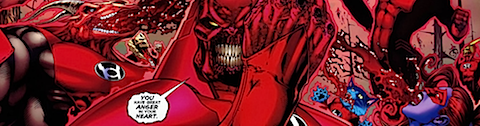
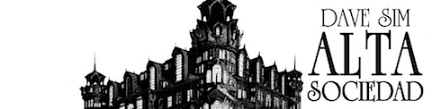
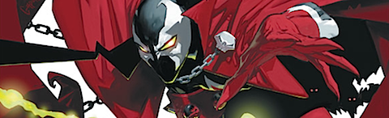
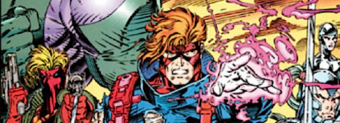
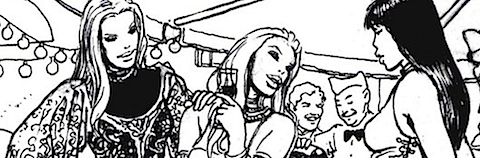

  

**Green Lantern: Rage of the Red Lanterns** (_Geoff Johns y varios dibujantes_, 2009) (edición americana)

Continúa el camino hacia _Blackest Night_ allá donde lo dejó [Green Lantern: Secret Origin](/leido-green-lantern-secret-origin-de-geoff-johns/). _Atrocitus_ y los _Red Lanterns_, _Ganthet_ y los _Blue Lanterns_, _Sinestro_ y sus propios _Corps_ amarillos, y pistas sobre los próximos contendientes en este próximo Apocalipsis galáctico. _Geoff Johns_ se está construyendo una nueva mitología completa para los _Lanterns_, entretejiéndola con todo lo que sabíamos hasta ahora, y de un modo magistral. Probablemente sea de lo mejorcito en cómic _mainstream_ que se ha podido leer en los últimos años. Gran guión y gran dibujo, aún contando con varios artistas, ya que todos mantienen una línea similar.

**Cerebus: Alta sociedad** (_Dave Sim_, 1986)

Aprovechando la reciente (e inesperada) edición en castellano de _Cerebus_ por parte de _Ponent Mon_, he probado suerte. Recomiendo leer acerca de la persona/personaje tras el tebeo, _Dave Sim_, acerca de su historia y de sus (muchos) momentos de extravagancia. Por ejemplo en la serie de artículos que le dedicó [Un tebeo con otro nombre](http://www.untebeoconotronombre.com/) ([I](http://www.untebeoconotronombre.com/archive/2009/dave_sim_un_hombre_una_obra.html), [II](http://www.untebeoconotronombre.com/archive/2009/dave_sim_un_hombre_una_obra_-_ii.html), [III](http://www.untebeoconotronombre.com/archive/2009/dave_sim_un_hombre_una_obra_-_iii.html) y [IV](http://www.untebeoconotronombre.com/archive/2009/dave_sim_un_hombre_una_obra_y_iv.html)), que ayudan a entender el porqué de que esta edición sea realmente inesperada.

Entrando en materia son 516 páginas de tebeo, de ahí que los llamaran _phonebooks_ en su momento. Es en ocasiones denso... y en ocasiones muy (muy) extravagante, rompiendo la aparente seriedad de los temas tratados. Aunque supongo que es de esperar siendo el protagonista un cerdo hormiguero bárbaro. Algunos personajes, como _Cucaracha Luna_ (y sus múltiples personalidades) o el propio _Lord Julius_, señor de _Palnu_ (dibujado como _Groucho Marx_), sin duda alguna rompen con cualquier suspensión de la incredulidad.

Por otro lado, _Dave Sim_ demuestra una capacidad para la narrativa apabullante, como pocas veces he tenido el gusto de leer. Realmente la vista se desliza de una viñeta a otra como si fuésemos otro personaje dentro de la escena, aún con sus arriesgadas maquetaciones de página. Cinco estrellas ganadas con justicia.

Sin embargo, juntando ambas características, la extrañeza y la narrativa, el total se queda en algo... raro. No me atrevo a recomendarlo a nadie, pero sí me atrevo a sugerir que le echéis un vistazo con tranquilidad y leáis varios capítulos seguidos, y a ver qué os parece. Yo por mi parte me haré con el siguiente tomo, a ver cómo evoluciona la historia (y como premio a _Ponent Mon_ por arriesgarse). Sin duda alguna ofrece algo único en el mundo del cómic.

  

**Spawn Origins, Volume 1** (_Todd McFarlane_, 1992) (edición americana)

_Todd McFarlane_ es otro tipo peculiar (el destino ha querido que hablara de él y de _Dave Sim_ en el mismo post), hijo de su época, y así es como hay que valorar el tebeo. Probablemente es de lo poco decente que salió del primigenio experimento que fue la editorial _Image,_ y aprovechando la edición en castellano he tirado por los mismos tomos en inglés, mucho más baratos.

Es un cómic que avanza muy lento, y seguirá haciéndolo durante los cien números que lo componen. Como autor tiene algunas cosas buenas, y otras muy malas. Algunos diseños magistrales, como el propio _Spawn_, junto a aberraciones del dibujo como _Violator_ u _Overt-kill_. Algunas composiciones impresionantes seguidas de viñetas sin control ninguno de la anatomía o la perspectiva. Líneas cinéticas _manga_ mezcladas con reminiscencias de _Frank Miller_. Sin embargo, como un todo, aún le queda un cierto aire incluso de obra de autor (madre mía lo que he dicho).

Sólo recomendable para quienes quieran recordar los 90, con todo lo que ello conlleva. Al fin y al cabo es un icono y, a día de hoy, es posible que incluso sea lo único que ha sobrevivido desde el inicio de _Image_, tras el cierre del sello _WildStorm_.

  

**Archivos WildC.A.T.S Tomos 1 a 4** (_Jim Lee y una barbaridad de gente más_, 1992)

Vienen a ser hasta el número 20 de la colección original, más todos los extras y productos relacionados. Ilegible visto desde cualquier prisma. El número tres ya es un _crossover_ con los _YoungBlood_. El segundo tomo tiene casi tantos números de _WildC.A.T.S_ como de _CyberForce_ (el _crossover_ _Killer Instinct_). En el tercer tomo (no llegamos al número 15) el autor original, _Jim Lee_, ya no participa. Al menos empieza a dibujar _Travis Charest_, que a mí me gusta. Los extras que se van incluyendo son realmente lamentables, números de relleno, números cero de colecciones, y demás despojos artísticos. Y el cuarto tomo es ya un compendio de ¡ocho! colecciones distintas que conforman el _crossover_ _WildStorm Rising_.

Empieza siendo muy pobre y va continuamente hacia abajo. Todos los grupos de todos los artistas que fundaron Image son los _X-Men_. Todos tienen un _Lobezno_ de pasado misterioso. Todos son igual de malos. Malos de carácter y malos en cuanto a calidad artística del tebeo. Los prólogos del editor, _Francisco Pérez Navarro_, son para enmarcar, porque ni él mismo cree en el producto que está editando, y se nota. Todo lo que dice son cosas negativas y, la verdad sea dicha, para eso se lo podía haber ahorrado.

Por decir algo bueno: Me encantan los diseños de _Jim Lee_ ¡Todos esos personajes son y debieron ser _X-Men_! Podría perderme observando sus viñetas, sólo por la fuerza que transmiten sus personajes... pero cuando dejó de dibujar la colección perdió todo sentido.

¿Y por qué he seguido comprando entonces? Por un extraño deseo infantil, siempre quise leer y comprar esta colección en su momento, y la dura realidad económica de un muchacho de instituto impedía el despilfarro. Había que elegir y la dejé de lado. Aunque la perspectiva me enseña que hice lo correcto, el recuerdo de cómo miraba las portadas en la librería y la sensación de no poder comprar más colecciones pervive en mí, y me vengo de aquel cruel pasado haciéndome con aquello con lo que no pude en su momento. Como _Spawn_ y los _WildC.A.T.S._

Pero, en serio, qué malos son estos dichosos tebeos.

****

**X-Men: Mujeres en peligro** (_Chris Claremont y Milo Manara_, 2009)

No me lo he leído, ni pienso hacerlo. Su mera compra responde a un impulso del cerebro reptiliano, el mismo que nos hacía soñar de adolescentes con esta posibilidad: el escritor de mutantes por antonomasia y el mejor dibujante de cuerpos femeninos que ha dado la historia del cómic. Pero no me importa de qué va. Sólo lo he comprado para ojearlo, como si fuera un libro de ilustraciones.