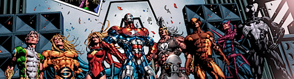
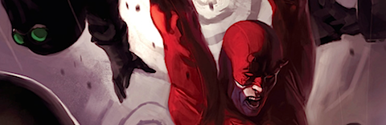

**Dark Avengers: Assemble** (_Brian Michael Bendis y Mike Deodato_, 2009) (edición americana)

Continúo con mi intento de ponerme al día con las dos colecciones que están llevando el pulso de las grandes editoriales los últimos años. A saber: _Green Lantern_ con _DC_ y su _Blackest Night/Brightest Day_ y _Los Vengadores_ con _Marvel_ (_Civil War, Secret Invasion_, etc.)

Tras la _Guerra civil_ que dividió al mundo superheroico de la editorial _Marvel_ en dos bandos, todo se solucionó con el ya consabido enfrentamiento contra un mal mayor que obliga a volver a unirse. Así, _Invasión secreta_ narró el intento de conquista de la tierra por parte de los malvadísimos _skrulls_, una raza de alienígenas cambiaformas que se infiltraron entre nosotros para acabar con toda forma de gobierno. Por supuesto al final la invasión fue desbaratada, pero las semillas de la desconfianza estaban sembradas entre la población, incapaz ya de seguir apoyando a estos grupos de vigilantes que no habían conseguido mantener la paz.

_Tony Stark_ (_Iron Man_) es destituido como líder de _SHIELD_, una suerte de supraorganización _a la_ "CIA con esteroides", posición que, por una serie de catastróficas casualidades, es ocupada por _Norman Osborn_, el empresario tras la máscara de _El duende verde_. Tal y como están las cosas, los anteriores _Vengadores_ se desbandan aún más de lo que ya lo estaban, y es precisamente _Norman Osborn_ quien recibe el encargo de formar un nuevo equipo, que siga llevando el mismo nombre de cara a la galería. Ese es el punto de comienzo de este tomo que contiene los seis primeros números de la colección.

Un grupo violento, sociópata y homicida formado en su mayor parte por algunos de los personajes criminales más violentos con los que cuenta la editorial. Ideas interesantes pero no originales. Entendámonos, tremendamente originales si tenemos en cuenta que están ambientados dentro del universo _Marvel_ tradicional, no es una realidad alternativa, no es un cómic de autor, no es una versión _Ultimate_ donde puedes hacer lo que quieras como guionista que a nadie le importa. No. Es un grupo oficial dentro del universo _Marvel_.

Sobre todo es reseñable la evolución del personaje de _Norman Osborn_, y su relación con sus subalternos, especialmente _El Vigía_, a quien siempre espero que desarrollen un poco más y nunca sucede del todo. ¿Qué puedes esperar de este tebeo? Leer a _The Authority_ pero ambientada en el universo _Marvel_ de siempre, incluyendo las muertes, la violencia y el lenguaje. Que hayamos llegado a este punto explica que hayan cancelado _The Authority_ recientemente. Como su propio guionista decía en una entrevista: _si ya puedes encontrar esto en los tebeos de siempre, no tiene mucho sentido continuar con ello ahora mismo_. Llega a ser interesante si quieres seguir la actualidad Marvelita, prescindible en otro caso.

**Daredevil: Cruel and Unusual** (_Ed Brubaker y Greg Rucka a los guiones, Michael Lark al dibujo_, 2008) (edición americana)

Tras los dos tomos de _Hell to Pay_, _Brubaker_ sigue realizando una sólida construcción del personaje, ya lejos de los tejemanejes superheroicos y completamente centrado en realizar un tebeo de género. Una historia sobre un preso en el corredor de la muerte que podría ser inocente, y de quienes quieren conseguir que parezca culpable. Podemos (casi) cambiar aquí a _Daredevil_ por un investigador privado con gabardina y la historia hubiese sido la misma.

Se nota el toque de _Greg Rucka_, otro de los pocos guionistas _mainstream_ que se atreven con el género negro, y viene perfectamente acompañado del dibujo sucio de _Michael Lark_. Recomendable si te gusta el tono del personaje de los últimos años y/o el género detectivesco. Quien busque un tebeo de tipos en pijama debería alejarse de él.

Ah, y _espectaculares_ las portadas de _Marco Djurdjevic_.