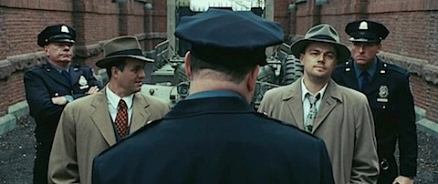
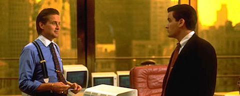

  

**[Shutter Island](http://www.imdb.com/title/tt1130884/)** (2010)

_Scorsese_ hace tiempo que ha dejado de sorprender, pese a que siempre se rodea de un equipo de profesionales que garantiza que todas sus obras van a tener un mínimo de calidad. Es decir, _Shutter Island_ tiene ese mínimo de calidad y, si no tenéis nada mejor que hacer, se puede ver. Pero no va a representar un impacto en vuestras vidas... de hecho yo apenas recuerdo ya la mitad de la trama.

Las fantasías oníricas a modo de _flashback_ se hacen largas y pesadas, y la música estridente más propia de una película de _Kubrick_ de los setenta sobraba.

  

**[Kick-Ass, listo para machacar](http://www.imdb.com/title/tt1250777/)** (_Kick-Ass_, 2010)

Muy lejos del tebeo original, cambiando por completo el tono, la forma y el fondo. Pasamos de un perdedor fracasado y asocial al héroe que se lleva a la chica. _Mark Millar_ no tiene suerte con sus adaptaciones al cine, aunque seguro que le importa bien poco, intuyendo los ingresos que estará recibiendo sólo con esto. Recomiendo el tebeo, la película no demasiado.

  

**[Las vidas posibles de Mr Nobody](http://www.imdb.com/title/tt0485947/)** (_Mr. Nobody_, 2009)

Aire a película independiente, estética y narrativa de videoclip, final (¿final?) no lineal y abierto a cualquier interpretación. Emotiva y deliciosa, yo necesito una de estas de vez en cuando, aunque probablemente no sea del gusto del público generalista.

  

**[Michael Clayton](http://www.imdb.com/title/tt0465538/)** (2007)

Hecha por y para _George Clooney_, como muchas de sus últimas películas. A medio camino entre el _thriller_ y el drama, sin llegar a centrarse en ninguno de los dos, termina por conformar una película pasable pero prescindible. Una historia de abogados que defienden a multinacionales sin escrúpulos. Extraña que _Tilda Swinton_ recibiera un _Oscar_ por su interpretación, que aún siendo buena, apenas rellena unos minutos (todo el metraje está ocupado por _Clooney_).

  

**[En el valle de Elah](http://www.imdb.com/title/tt0465538/)** (_In the Valley of Elah_, 2007)

Del mismo tono que la anterior, a medio camino entre el drama y el _thriller_, nos cuenta la investigación de un padre acerca de su hijo desaparecido, todo ello en el ambiente militar norteamericano post-segunda guerra del golfo. Decente, y con una impresionante interpretación de _Tommy Lee Jones_, que se quedó en "sólo" una nominación. Debió ganar el premio.

**[Si la cosa funciona](http://www.imdb.com/title/tt1178663/)** (_Whatever works_, 2009)

De lo mejor que ha hecho _Woody Allen_ últimamente, con un gran _Larry David_. Y esta sí que es fácilmente interpretable, para que todo el mundo entienda claramente las premisas de la historia y del propio título. Y es que, ¿si la cosa funciona qué más le da al mundo lo que haga cada uno?

**[El mensajero del miedo](http://www.imdb.com/title/tt1178663/)** (_The Manchurian Candidate_, 2004)

Otro _thriller_ político-científico-tecnológico con el argumento más inverosímil que me he echado a la cara en mucho tiempo. Todo me parece que está cogido con pinzas desde el primer minuto. Y, ya puestos, ¿por qué no le pegan un tiro a _Denzel Washington_ nada más comenzar y así la trama política no peligra? Es que no entiendo por qué esta gente puede deshacerse de congresistas y no de un militar de tres al cuarto, medio loco, que no le importa a nadie. Porque el final era alcanzable sin que fuera precisamente ese personaje quien lo provocara. Película ignorable.

**[Wall Street](http://www.imdb.com/title/tt0094291/)** (1987) **revisionado**

Revisionado aprovechando que se ha estrenado hace poco la "continuación". La original es más que decente, con un gran _Michael Douglas_, con un gran _Martin Sheen_ en los escasos minutos que tiene, y con un incipiente _Charlie Sheen_ pasable. Sobraba _Daryl Hannah_, pero algún personaje femenino había que meter para poder tener una escena de sexo, que eran los ochenta. Recomendable.

**[La red social](http://www.imdb.es/title/tt1285016/)** (_The social network_, 2010)

Que alguien produzca un _biopic_ sobre una persona que tiene 26 años me parece tan lamentable como que se publiquen biografías de _Cristiano Ronaldo_, pero es lo que hay. Cinematográficamente es muy decente, y le da una narrativa a algo que apenas podría pasar de documental, pese a terminar en la más absoluta nada al carecer de una línea argumental con un destino claro... y es que no ha habido ningún evento en la vida del protagonista (el real) que pudiera servir como final cinematográfico.

Por otro lado, me quedo con el pensamiento de que _Mark Zuckerberg_ debe caerle muy mal a alguien con los recursos suficientes como para producir esta película, contar con un guionista y un director de renombre, y estrenarla en cines en tantos países. No recuerdo otro intento similar desde "_Piratas de Silicon Valley_", que tuvo distribución directa a vídeo si mi memoria no me engaña.

Es difícil dejar a alguien peor ante el público sin involucrar brea y plumas en la plaza mayor del pueblo.