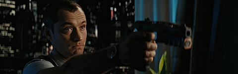
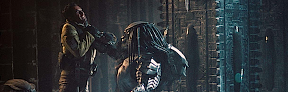

**[Iron Man 2](http://www.imdb.com/title/tt1228705/)** (2010) **revisionado**  

Sigue pareciéndome una de las mejores y más divertidas franquicias que ha dado el cine superheroico. La verdad es que a una película de acción y aventuras no se le puede pedir mucho más.

**[Repo Men](http://www.imdb.com/title/tt1053424/)** (2010)

Una pérdida de tiempo sin sentido. Extremadamente violenta y sangrienta, lo que bien explotado podría haber sido interesante, pero no. Y un giro final que invalida media película. _Bleg_. Y eso que soy fan de _Jude Law_.

**[Teniente corrupto](http://www.imdb.com/title/tt1095217/)** (_The Bad Lieutenant: Port of Call - New Orleans_, 2009)

Aburrida. Ni me sonaba su existencia, venía de regalo con un periódico, en uno de esos _dvd_ que nadie quiere hasta que, no sabes bien cómo, acaban en tu casa. Si alguien la quiere la regalo.

**[Aliens vs. Predator](http://www.imdb.com/title/tt0370263/)** (2004) **revisionado**

Sueño de adolescentes de todo el mundo, conseguir que se enfrentaran en la pantalla los dos máximos exponentes de la icónica fuerza plástica que puede desarrollar la ciencia-ficción. Lástima que sea para formar una desgracia de película. La idea base no está mal, pero no se desarrolla correctamente, construyendo unos personajes planos y lamentables que no despiertan el más mínimo interés. Y casi mejor, porque para lo que duran en pantalla...

**[Aliens vs. Predator 2](http://www.imdb.com/title/tt0758730/) (_Aliens vs Predator_**_: Requiem_, 2007)

Si la primera era mala, esta, que no me explico cómo ha llegado a existir, ni os lo podéis llegar a imaginar. Debería enseñarse en escuelas de cine para mostrar cómo no construir personajes ni escenas. Todo está demasiado oscuro, lo que no deja distinguir qué carajo está pasando, aunque los Alien saliendo desde dentro de niños y de mujeres embarazadas os juro que no me lo esperaba. Y eso que la película contaba con el-bicho-definitivo: el Alien generado dentro de un Depredador. ¿El _Aliendator_? _Predalien_ según la _Wikipedia_. Bah, mi nombre acongoja más.

  

**[En el punto de mira](http://www.imdb.com/title/tt0443274/)** (_Vantage point_, 2008)

Misma situación contada desde el punto de vista de múltiples protagonistas que se van cruzando. Cada vez que nos presentan un nuevo protagonista vuelven a contar (casi) todo de otro modo, lo que al principio se hace pesado pero va solucionándose según avanza el metraje. Psé. Podría merecer la pena, pero la trama se descubre demasiado complicada como para que el espectador pueda meter baza adivinando qué es lo que está pasando.

_Bonus_: está ambientada en una España (en Salamanca concretamente) que parece más bien Casablanca. Aquí no vestimos así, las casas y las calles no son así, y en nuestras fiestas no hay tantas banderas nacionales a menos que la selección gane el mundial. Ni hacemos fiesta porque vengan presidentes de otro país. La ambientación está casi al mismo nivel que en _Misión imposible 2_.

Pero ¡eh! Sale _Jack_.

**[Tigerland](http://www.imdb.com/title/tt0170691/)** (2000)

Unos cuantos soldados de diversa procedencia durante su entrenamiento previo a ser enviados a una tardía guerra de Vietnam. Si la primera mitad de _La chaqueta metálica_ fuera toda la película esto se le parecería mucho. La verdad es que no está mal, aunque no veo a _Colin Farrell_ como actor dramático. Me gustó.

**[Celda 211](http://www.imdb.com/title/tt1242422/)** (2009)

Venga, voy a llevarle la contraria a todo el mundo: que sí, que la historia no está mal, y todo lo que queráis, pero... pues no es para tanto. Tiene un millón de planos horribles _made in spain_ que no podía soportar, no digamos ya en las escenas que deberían tener un poco de acción. Viendo que esto es lo mejor que proporciona el cine español (y no está mal), explica muchas cosas. En serio, ¿en este país no se enseña dónde poner la cámara en una escena?

Al menos cuenta con grandes actores, y con un gran protagonista, aunque _Luis Tosar_ eclipsa a los demás en pantalla.
