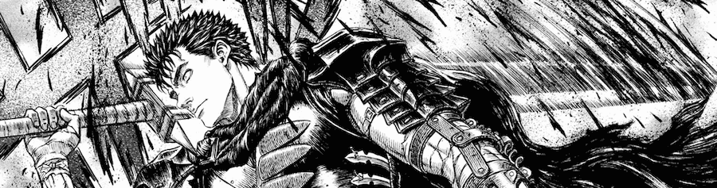

Si tienes un nombre como **[Kentaro Miura](http://en.wikipedia.org/wiki/Kentaro_Miura)**, en la vida sólo puedes aspirar a molar. A los 22 años, en 1988, tras algunas obras menores presentadas a concursos, dibujó una historia corta titulada _Berserk Prototype_ -- incluída, por cierto, en el tomo 14 de la edición española actual --, que le sirvió para empezar a trabajar para la revista _Animal House_ dibujando sobre los guiones de otros escritores. Un par de años después retomó aquella historia y empezó a publicar [**Berserk**](http://en.wikipedia.org/wiki/Berserk_(manga)). Desde entonces han pasado 22 años. Publicando al ritmo que le da la gana.

> La historia de su publicación en España daría para otro artículo, ya que ha pasado por múltiples editoriales, empresas que se separan, leyendas del mundillo no muy claras sobre ediciones piratas, y un largo etcétera que no nos importa. Desde hace un año _Glénat España_ (ahora _EDT - Editores de Tebeos_) publica _Berserk_ siguiendo dos numeraciones: cada mes aparecen varios tomos desde el número uno y desde el número 31 -- siguiendo donde se quedó la anterior editorial en España, en un gesto de agradecer para los antiguos lectores --. Quienes empezamos desde el primero algún día alcanzaremos a la edición actual, que se publica a un ritmo más lento. 36 tomos existen hasta hoy en la edición japonesa, en español a la hora de escribir estas líneas del 1 al 16 (los que yo llevo leídos) y del 31 al 35.

Aún es pronto para los aburridos resúmenes que todos haremos en Diciembre con las mejores películas, libros y tebeos, y los propósitos de año nuevo, pero yo ya tengo claro que _Berserk_ estará entre los mejores tebeos leídos este año. Argumentalmente no es más que una serie de grandes incógnitas superpuestas, a las que el autor no parece interesado en dar respuesta, entretenido como está en dar rienda suelta a las actitudes más viscerales de los protagonistas, criaturas a las que alguien hubiese soltado dentro de este mundo fantástico, como si de un _sandbox_ se tratase, sólo para crear el caos y el ruido. Sorprendentemente, el arte no sólo no ha envejecido mal, sino que sigue mostrándose con una fuerza dinámica esplendorosa tras los años que lleva encima.

Un protagonista, _Guts_ (_Gatsu_ en otras traducciones menos literarias y más fonéticas) que no es más que un guerrero iracundo portador de una enorme espada y una prótesis en un brazo. ¿Quién es? No lo sabemos. ¿Qué hace? No lo sabemos. ¿A quién busca? No lo sabemos. Pero lucha, mata, destruye, mutila y arrasa con todo aquello que se plante ante él, durante tres tomos. En ese momento comienza un _flashback_ en el que iremos viendo la evolución cronológica del personaje desde su nacimiento hasta, suponemos, el punto en el que comienza la serie.

Violencia cruda, sanguinaria, que produce incluso desasosiego en determinados momentos, dibujada con un detallado esmero, que nos muestra cada golpe, cada tajo y cada víscera despedida página tras página. No es, desde luego, para todos los públicos, y se gana a pulso el "Sólo para adultos" que rezan las portadas. Y aún así sigue siendo lo primero que busco en la librería cuando llegan las novedades. Quiero saber más, y quiero leer más.