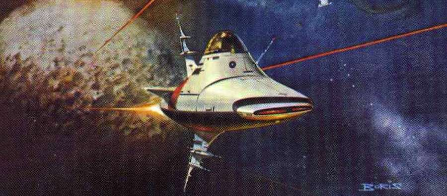

**_Meh_**.

Gran potencial y escaso desarrollo, eso es lo que me viene a la mente tras terminar la lectura de **Pórtico** (_Gateway_, _Frederik Pohl_, 1977), ganadora de los premios _Hugo_, _Nebula_ y _John W. Cambell Memorial_ del año siguiente.

Descubierta en el sistema solar una estación espacial alienígena abandonada mucho tiempo atrás, la humanidad se organiza para utilizar las herramientas y lanzaderas encontradas e intentar explorar el espacio con instrumentos incomprensibles e impredecibles. Así, cualquier viaje se convierte en un juego de azar donde los tripulantes de cada lanzadera no saben a dónde viajarán, cuánto tiempo tardarán o incluso si llegarán a volver.

_Portada de la edición original, por Boris Vallejo. Ni punto de comparación con [lo que tenemos hoy en día](https://www.instagram.com/p/R7awpKyxCo/)._



Pese a tener un punto de partida a priori muy apto para una novela de ciencia ficción _hard_, se convierte en una novela _soft_ donde deberían primar la construcción de los personajes y sus relaciones. Por desgracia se pierde en plantear situaciones repetitivas y un elenco de secundarios confusos y perfectamente intercambiables entre ellos, e interrumpe constantemente la narración con pequeños anexos a modo de carteles encontrados en la estación **Pórtico**, que en ocasiones no añaden nada al trasfondo y rompen el flujo de lectura.

La narración se alterna entre las vivencias del protagonista desde que consigue pagarse un billete a la estación espacial y las sesiones de terapia con un psicólogo robótico tras su vuelta, siendo esta estructura probablemente el mayor acierto de la novela. El personaje en un principio no es más que una excusa para identificar al lector, poca educación para que pregunte todo y nosotros nos enteremos, paga el viaje con un premio de lotería que explica que no tiene a dónde volver ni dinero, sin familia... trucos muy obvios y poco elegantes. Por suerte estos diálogos con su terapeuta nos van descubriendo algo más del personaje a cada capítulo, mejorando la mala impresión inicial.

Sorprenden algunas circunstancias de la novela, como la constante sexualización de cada situación, hasta que el lector llega a preguntarse si no habrá otra forma de sublimar las energías cuando uno está en el espacio. 35 años después de ser escrita, clama al cielo que alguien llegue a plantearse siquiera que se pueda fumar en una lanzadera espacial.

Probablemente sea el final el mayor _Meh_ de toda la narración, terminando en una gran nada que no mejora la impresión insustancial de las páginas precedentes. Aparentemente fue continuada por otras tres novelas que exploran y explotan el mundo construido en esta primera, pero habiendo visitado esta primera parte, creo que se quedarán sin leer.