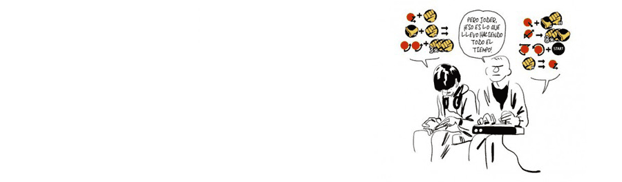

[**Bastien Vivès**](http://es.wikipedia.org/wiki/Bastien_Viv%C3%A8s) es un historietista francés nacido en 1984. Empieza a dolerme el alma cuando escribo algo relativo a gente más joven que yo, pero haré el esfuerzo. No lleva más de seis años publicando obras y ya se ha destapado como una de las revelaciones europeas, con obras como _El gusto del cloro_, _Polina_ o la deliciosa gamberrada _Los melones de la ira_. Entre estas obras mayores está publicando pequeños recopilatorios de humor gráfico temático, del que este **Videojuegos** es el primer volumen (_Le Jeu vidéo_, _Bastien Vivès_, 2012).

_Portada de Videojuegos, de Bastien Vivès_

Por supuesto, en estos volúmenes el humor está centrado en un tema concreto, en este caso los videojuegos que le dan título. Pequeños chistes con situaciones cotidianas alrededor de juegos nuevos y antiguos, salones recreativos o hijos, parejas y padres de aquellos que disfrutan del videojuego. Se percibe en algunas de estas páginas el conocimiento y el cariño que profesa el autor hacia el medio que es base para su humor, y si eres también aficionado seguro se te escapará alguna carcajada.

Llama poderosamente la atención la facilidad que tiene _Vivès_ para dar vitalidad a sus dibujos con apenas unas pocas líneas y alguna mancha de tinta, haciéndose notar su formación en cine de animación en la fluidez de sus viñetas. Poco más se puede comentar de algo que, con tan poco, consigue conformar una obra tan grande. Leedla.
