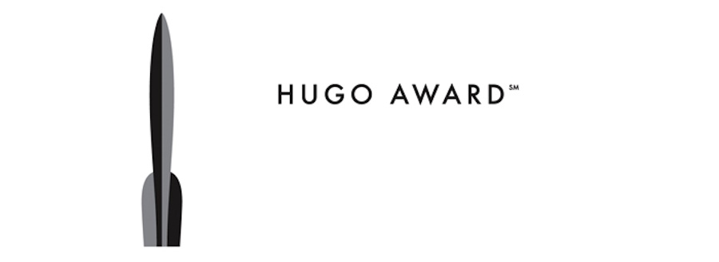

Es un proyecto de lectura tan válido como pueda serlo el de "_todos los libros cuyos títulos no tengan la letra a_". Es decir, una excusa para leer. Leer más, no necesariamente mejor, pero al menos con un criterio de partida.

Desde 1953 se conceden los [**premios Hugo**](http://en.wikipedia.org/wiki/Hugo_Award) a las mejores obras en los campos de la fantasía y la ciencia ficción -- es decir, son premios _de género_, vaya el aviso por delante --. Son votados por los visitantes (de pago) de la convención _WorldCon_ y, dado que no existen normas escritas sobre qué califica a una obra para que esta sea considerada fantasía o ciencia ficción, más que el hecho de que sean propuestas para votación a principios de año, podría decirse que son unos premios bastante democráticos. No es que esto sea bueno o malo _per se_, pero explica algunas de las obras premiadas.

_El logo es un cohete. Bien._

Existen numerosas categorías, aunque quizá las más importantes sean las de relato y novela, siendo esta última la que más me interesa a mí, que es lo que importa en este caso. Como peculiaridades, en 1954 y 57 no hubo premios de novela, pero desde mediados de los noventa se entregan también los _retrohugos_ para solventar que haya habido ediciones de la _WorldCon_ sin sus respectivos premios, habiendo "solucionado" ya los años 46, 51 y 54.

Por si fueran pocos libros, en al menos tres ocasiones se han producido empates de votos (66, 93 y 2010), teniendo estos años dos novelas ganadoras _ex aequo_. Y por si esto a su vez fuera poco, en ocasiones los premios han recaído en terceras, cuartas o quintas partes de alguna saga, lo que me obligará quizá a leerlas enteras. Por suerte la esperanza de vida de nuestra civilización es bastante alta.

Algunas contras tenía que tener este plan de dominación mundial: ciertos premios son inexplicables. En 1983 la cuarta parte de la saga de la _Fundación_ de _Isaac Asimov_ recibió el premio, obligándome a leer las tres anteriores, aparentemente de mayor calidad a tenor de las reseñas que he leído. En 2003 _Homínidos_, primera parte de una trilogía escrita por _Robert J. Sawyer_, un escritor de _best sellers_ canadiense -- el año que la convención se celebró en Canadá --. En 2001 fue para la cuarta parte de _Harry Potter_.

Pero teniendo en cuenta que se han entregado ya 65 premios _Hugo_ de novela, creo que hay mucho y muy bueno que leer antes de llegar a las malas obras. Cinco libros de _Heinlein_, cuatro de _Lois McMaster Bujold_, obras creadoras de nuevos géneros como el _Neuromante_ de _William Gibson_, clásicos de _Clarke_, _Zelazny_ o _Dick_ y un largo etcétera.

Existen otros premios, como el [_Philip K. Dick_](http://en.wikipedia.org/wiki/Philip_K._Dick_Award) que se entrega desde el 1983, los premios [_Nebula_](http://en.wikipedia.org/wiki/Nebula_Award) desde el 66 (considerados junto a los _Hugo_ como los más importantes), los entregados por la revista _[Locus](http://en.wikipedia.org/wiki/Locus_Award)_ desde 1971, el [_John W. Campbell Memorial_](http://en.wikipedia.org/wiki/John_W._Campbell_Memorial_Award_for_Best_Science_Fiction_Novel) desde 1973 o, más cercanos, los premios [_Ignotus_](http://es.wikipedia.org/wiki/Premio_Ignotus) a la mejor novela española y extranjera, desde 1991. Cualquiera de ellos sería perfectamente válido como proyecto de lectura y, en ocasiones, incluso coinciden: _Pórtico_, de _Frederik Pohl_ ganó los premios _Hugo_, _Locus_, _Nebula_ y _John Campbell Memorial_. _Neuromante_ de _William Gibson_ ganó _Nebula_, _Dick_ y _Hugo_. Y así un largo etcétera.

¿No es un proyecto de lectura fabuloso? En [esta página](https://www.neverbot.com/los-premios-hugo/) iré apuntando los que vaya leyendo. Avisad si tenéis alguna recomendación especial.