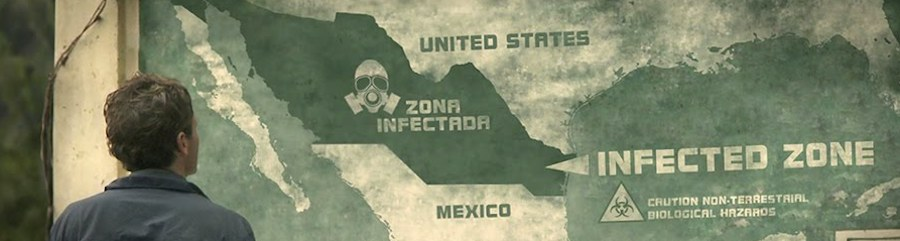

En **[Monsters](http://www.imdb.com/title/tt1470827/)** una pareja que no es pareja debe atravesar medio México para volver a la frontera con Estados Unidos, cruzando una amplia zona en cuarentena por invasión alienígena. ¿A quién no le ha pasado algo parecido? No nos dejemos engañar por la presencia de marcianos; es una película pausada, de carácter intimista y con una estética que busca el impacto fotográfico de los grandes escenarios abiertos como herramienta con la que transmitir la inferioridad y soledad de los protagonistas. El componente fantástico es anecdótico en la narración, poco más que el _MacGuffin_ que sirve de hilo conductor. Es, sin embargo, llegado el último minuto de la película cuando una melodía silbada te retrotrae a la primera escena, comprendiendo que no era un comienzo, sino un final. El recuerdo es tan vago que puedes dejarlo estar, teniendo un final abierto, o puedes retroceder el vídeo para comprender el dramatismo del final cerrado ante el que te encuentras.

_Monsters (dirigida por Gareth Edwards, 2010)_

Similar efecto ha surtido [**Take Shelter**](http://www.imdb.com/title/tt1675192/), donde un padre de familia sufre visiones psicóticas que le sumergen en una espiral de locura. Vívidos sueños relacionados con una gran tormenta le impelen a construir un refugio en el jardín trasero de su casa, realimentando su más que posible esquizofrenia. Largos planos que mantienen la tensión de principio a fin, hasta una última escena, de apenas diez segundos, que explica claramente si las visiones eran una enfermedad mental o adelantos de un futuro por venir.

_Take Shelter (dirigida por Jeff Nichols, 2011)_

En ambos casos, apenas unos instantes convierten un final abierto, una narración con puntos a unir por el espectador, en algo claro, conciso y cerrado. Destruyen la verdadera sensación de completitud en el espectador, la que él mismo se construye, por una artificialidad que deja un vacío, el hueco de los personajes que nos han robado impidiéndonos sacar conclusiones.

Que también está bien, y así el público no se queja de si la peonza de _Inception_ se cae o no.
