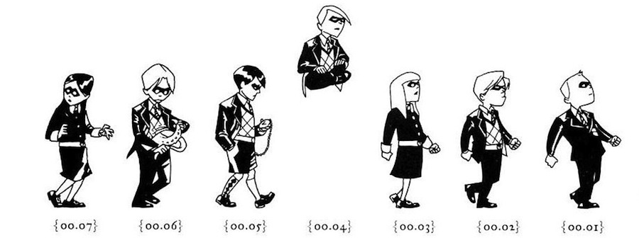

Los dos tomos de [**Umbrella Academy**](http://en.wikipedia.org/wiki/Umbrella_Academy) publicados hasta la fecha, de título _Apocalypse Suite_ y _Dallas_, forman uno de los mejores tebeos editados durante la primera década de este siglo. Y así, haciendo grandilocuentes declaraciones incomprensibles para muchos, es como he decidido empezar hoy.

Plagado de referencias a la cultura pulp y pop, el guión de [**Gerard Way**](http://en.wikipedia.org/wiki/Gerard_Way) -- sí, acabemos con esto cuanto antes, el mismo _Gerard Way_ que es vocalista de _My Chemical Romance_ -- es un excelente caldo de cultivo para el dibujo de un [**Gabriel Bá**](http://en.wikipedia.org/wiki/Gabriel_B%C3%A1) detallista e imaginativo, en la línea del arte de un _Mike Mignola_ o _Eduardo Risso_ con más calor y color.

_Umbrella Academy, ilustración de Gabriel Bá_

Por supuesto, una historia que incluye superpoderes, locos viajes en el tiempo, vampiros del vietcong, robots asesinos o peces de colores líderes de organizaciones secretas tiene todos los ingredientes para poder experimentar y sorprender al lector. Y hay monos. Todo el mundo sabe que con monos todo es más divertido.

Con el primer arco, _Apocalypse Suite_, se plantean las premisas que moldean a los personajes protagonistas, y se narra un primer argumento cerrado que es la perfecta introducción a la serie, premio [**Eisner**](http://en.wikipedia.org/wiki/Eisner_Award) y [**Harvey**](http://en.wikipedia.org/wiki/Harvey_Award) del año 2008 -- a la mejor serie limitada y mejor nueva serie respectivamente --. El segundo, _Dallas_, entra en mayor profundidad en el carácter de cada personaje sobre el grupo y, aunque a mi juicio tiene quizá peor ritmo que el primer tomo, se viene arriba con un explosivo e inesperado final. Pese a haber sido anunciado un tercer tomo, lleva ya años de retraso y albergo dudas con que llegue a ver la luz, aunque el carácter autoconclusivo de cada tomo no impide el tremendo disfrute que proporcionan las páginas publicadas hasta ahora.