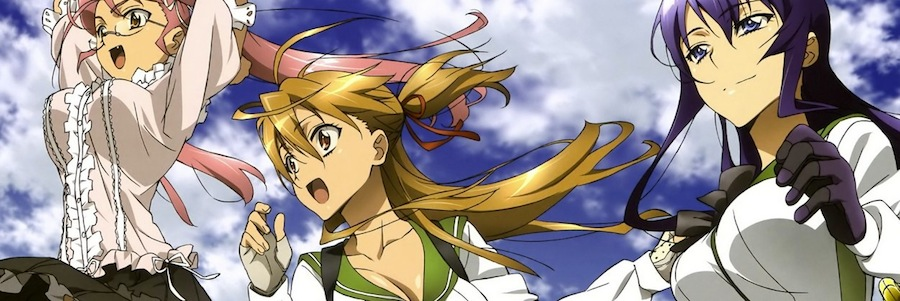

Hace poco terminaba de ver la primera -- y, aparentemente, única -- temporada de [**High School of the Dead**](http://en.wikipedia.org/wiki/High_School_of_the_Dead), la serie de animación de [**Madhouse**](http://en.wikipedia.org/wiki/Madhouse_(company)) basada en el manga de los hermanos _Daisuke_ y _Shoji Sato_, y sólo podía pensar en que la definición de [**fanservice**](http://en.wikipedia.org/wiki/Fanservice) se le quedaba corta. Este término, heredado precisamente del universo del _manga_ y _anime_ pero aplicado hoy día a casi cualquier obra cultural, trata de explicar esos elementos o escenas colocados ahí exclusivamente para complacer algún deseo oculto del espectador. No añaden nada a la obra o a su narrativa, pero satisfacen instintos.

En _High School of the Dead (HOTD, con su propio acrónimo)_, los personajes son adolescentes inmersos en las clases de un instituto cuando comienza la invasión zombi, siguiendo todas las reglas y clichés del género sin vergüenza ninguna. Por supuesto en todos los aspectos _HOTD_ raya en niveles de calidad muy altos -- impecable técnicamente como todo lo salido del estudio _Madhouse --,_ entretiene y emociona a partes iguales. Pero lejos de tomarse en serio a sí misma, ya desde su inicio comienza a deleitarse en prendas de ropa que se rompen en todos los personajes femeninos, lúbricas y neumáticas carreras con la cámara centrada en aquellas partes de la anatomía más turgentes, armas cada vez más grandes en una orgía de _gun-porn_, una cantidad contenida de sangre y vísceras -- esto me hace pensar por un momento en el _gore_ como uno de los géneros pioneros en el concepto de fanservice, pero lo dejaremos para conocedores del medio -- y un largo etcétera. ¿Por qué? Porque es lo que el espectador tipo de esta serie realmente quiere ver. ¿Por qué no dárselo?

_He intentado buscar una ilustración de High School of the Dead sin pechos, pero no la he encontrado._

Con estos pensamientos en la cabeza le di un revisionado a las primeras temporadas de [**Community**](http://en.wikipedia.org/wiki/Community_(TV_series)), una de las mejores series americanas de los últimos años, y la amalgama de referencias a la cultura pop que impregnan cada capítulo se hicieron mucho más obvias. Mucho más de lo que ya eran, dentro de una serie también sincera consigo misma desde su impredecibilidad argumental. En _Community_ el personaje de _Abed_ es incapaz de percibir la realidad desde fuera de su particular perspectiva de amante del cine y la televisión, haciendo continuos paralelismos -- chistes para el espectador -- con la historia del medio, proporcionando un mayor grado de implicación emocional con el público. No añade nada -- casi nunca -- a la trama, pero entretiene a un tipo de espectador concreto. Desde este punto de vista, incluso la elección de _Chevy Chase_ como parte del reparto es en sí mismo parte del _fanservice_, rescatando a una vieja gloria del humor televisivo. Todo está impecablemente medido en _Community_, consiguiendo una fidelidad inusual por parte del público, que percibe la serie como "algo suyo". "- _¿Cuál es el sentido de la Navidad? - La primera temporada de Perdidos_".

__

_Troy and Abed in the morning, en algunos finales de episodio de Community._

Al varón adolescente le damos zombis, culos, disparos y explosiones. Al treintañero amante de la televisión le damos continuas referencias a la historia del medio y cameos de actores de otras series. Entonces maduremos todos (los espectadores o lectores, como gran gremio conjunto de hermanos) y no nos ofendamos porque a las hormonadas adolescentes [**Crepúsculo**](http://en.wikipedia.org/wiki/Twilight_(2008_film)) les da vampiros redimidos en búsqueda de un concepto caduco y trasnochado de amor, porque eso es precisamente lo que quieren ver y lo que les gusta y complace. No nos llevemos las manos a la cabeza porque la comunidad [s&m](http://en.wikipedia.org/wiki/BDSM) afirme que el comportamiento de los protagonistas de [**50 sombras de Grey**](http://en.wikipedia.org/wiki/50_Shades_of_Grey) no es creíble, ya que no es eso lo que importa. No se busca credibilidad, no se busca realismo, se busca satisfacer a un tipo de público concreto con pequeños detalles que realmente no añaden nada, pero complacen a su consumidor haciéndole pensar que sí importan. Desde esa perspectiva, todas son grandes obras comerciales.

__

_Taylor Lautner/Jacob ¿Tiene que quitarse siempre la camisa? Obviamente sí, es lo que se espera del personaje._