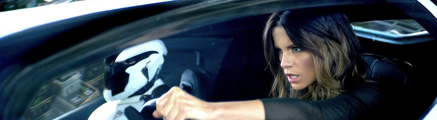
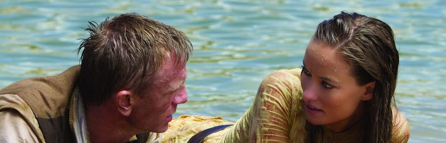

Veo el trailer del remake de [**Desafío Total**](http://www.imdb.com/title/tt1386703/) (_Total Recall, 2012_) protagonizada por _Colin Farrell_, _Jessica Biel_ y \*ay\* _Kate Beckinsale_ y me emociono. Luego veo la película y se me viene el mundo al suelo. Tres cuartas partes del film son una orgía visual desatada y excesiva, un diseño de producción de _Blade Runner_ mal entendido que mantiene la atención apartada del argumento con coches flotantes, putiferio robótico y luces por doquier. Sin embargo, ante un espectador motivado mantiene el tipo con la incógnita de cuánto tendrá de diferente con la maravillosa versión original de _Schwarzenegger_ dirigida por _Paul Verhoeven_ ([_Total Recall, 1990_](http://www.imdb.com/title/tt0100802/)).

Llega entonces el último acto y el castillo de naipes se viene abajo con una retahíla de decisiones injustificables, villanos de opereta que explican su plan, planes de invasión que no tendrían sentido ni en el más absurdo de los tebeos americanos de los noventa, y una gran explosión (eso BIEN). Uno sólo puede echar de menos los tiempos en los que el cine de género era cine de género, y no intentaba contentar a espectadores fuera de su nicho.

__

_El protagonista es Colin Farrell, pero me da igual._

Desalentado por este aparente fracaso, me refugio en [**Cowboys & Aliens**](http://www.imdb.com/title/tt0409847/) (_2011_). La premisa es perfecta: los marcianos llegan a la tierra en la época de la conquista del oeste americano. Naves espaciales, lásers, escopetas, indios y caballos. Y _Olivia Wilde_. Todo ello dirigido por _Jon Favreau_. Sólo podría tener más puntos a favor si también apareciesen ninjas y dinosaurios, pero tampoco hay que abusar. Y una vez en marcha... la desolación. Actores sobreactuados, escenas de acción mal llevadas, media docena de personajes que sobran, un cambio de motivación del protagonista a mitad del metraje, personajes que resucitan en un _deus ex machina_ vergonzante y... trato de ser positivo, pero no es sencillo.

__

_Daniel Craig y Olivia Wilde en Cowboys & Aliens_

No hablaré hoy en este lugar de [**Prometheus**](http://www.imdb.com/title/tt1446714/) (_2012_) porque, aunque recuerdo salir del cine con una horrenda impresión, ciertas cosas dejaron un poso que estuve rumiando durante varios días, detalles que podrían convertirse en un gran SÍ entendiendo la película como primer episodio de una saga. Necesito un revisionado con calma antes de volver a ella.

En cualquier caso, con todas estas premisas, ¿qué esperar del [**After Earth**](http://www.imdb.com/title/tt1815862/) de _Shyamalan_ con _Will Smith_ y familia?

¿Qué esperar del [**Oblivion**](http://www.imdb.com/title/tt1483013/) de _Tom Cruise_ y _Morgan Freeman_?

Peor aún, ¿qué esperar de [**El juego de Ender**](http://www.imdb.com/title/tt1731141/)?