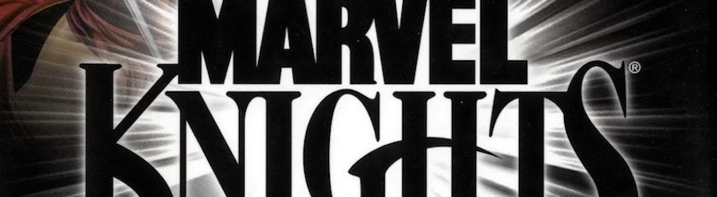
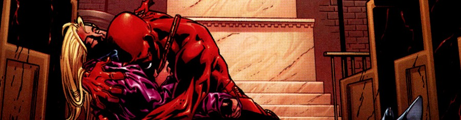

Nací en 1979, y durante siete días conocí los setenta. Si los ochenta definieron mis (nuestros) recuerdos de infancia y nuestra formación como personas, los noventa son el despertar cultural de nuestra generación, y con esto se entienden muchas cosas. Los noventa son la llegada del manga, las películas de _Kevin Smith_ en _VHS_ -- que aún guardo en alguna caja --, las canciones de _Nirvana_ y el pensamiento de que La Universidad -- en mayúsculas -- es una institución respetable que te convierte en mejor persona.

En _Marvel_ estaban sufriendo su propio rito de paso, prácticamente recuperados del desmantelamiento editorial que supuso la fundación de _Image Comics,_ encontrando nuevas estrellas. Cuando las series de mutantes dominaban las ventas hasta donde alcanzaba la vista, personajes hoy imprescindibles pasaban por sus horas más bajas: clones y cambios de identidad en un sindiós del que tardarían años en sacar a algunas colecciones.

En esta situación surgió el sello "[**Marvel Knights**](http://en.wikipedia.org/wiki/Marvel_Knights)". Varias colecciones, prácticamente muertas hasta el momento, con nuevos autores y argumentos. Es decir, una maniobra comercial como cualquier otra, una excusa para revitalizar ventas en un mercado en decadencia como era el del _comic-book_, pero que visto en perspectiva representó el principio del cambio a la _Marvel_ que tenemos hoy en día. Y de esta primera hornada de series probablemente fuera la más notoria [**Daredevil**](http://en.wikipedia.org/wiki/Daredevil_(Marvel_Comics)), guionizada por un [**Kevin Smith**](http://en.wikipedia.org/wiki/Kevin_smith) recién glorificado en el cine independiente _freak_ y dibujada por [**Joe Quesada**](http://en.wikipedia.org/wiki/Joe_Quesada) antes de que llegara a ser editor en jefe de toda _Marvel_.

__

_Te echamos de menos, Karen._

Entrando en materia: es un tebeo excepcional. Un punto de inflexión para el personaje, preparándolo para una larga etapa de casi quince años ya de grandeza argumental -- _Daredevil_ ES lo mejor de _Marvel_. _Daredevil_ ES _Marvel_ --. Cuenta con los ingredientes precisos: una historia autoreferencial que respeta al personaje, unos _cliffhangers_ de espanto, recuerdo de cuando los tebeos todavía se contaban con historias de 24 páginas, una villano con sorpresa y, lo más importante de todo, la sensación de que el tebeo no quiere crear historia y marcar al lector, sino simplemente ser respetuoso con cómo deberían hacerse estas cosas. Con una historia hija de los noventa que pone la primera piedra de lo que se vendría a construir, el guión de _Smith_ sorprende por su calidad para un primerizo en el cómic _mainstream_, cualidad que se entiende desde lo cinematográfico de la narración, con un excepcional uso de los personajes secundarios de la serie. El arte de _Quesada_ está en uno de los puntos más altos de su carrera, antes de que se pusiera experimental o sus labores editoriales le mantuvieran apartado de la mesa de dibujo. Ocho números, un principio, un fin. Perfecto.
