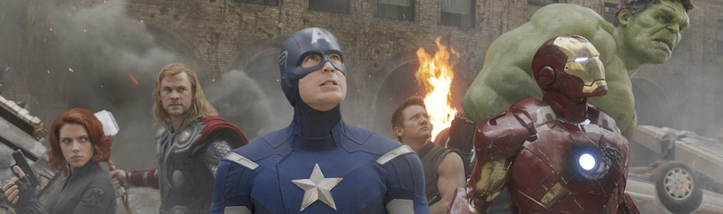
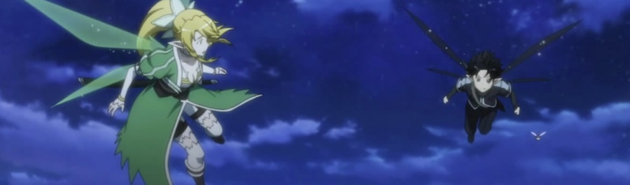
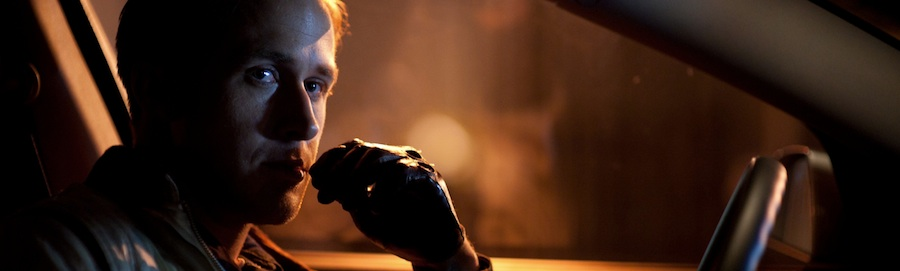
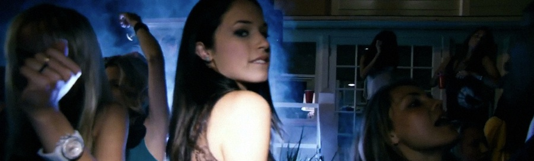

Mucho mejor título para el post que cualquier "_Los mejores del año_" y similares, dónde va a parar. Es en mi caso una lista tramposa, porque voy a contracorriente de las novedades del mercado: aún no he jugado a un sólo videojuego que se haya publicado durante el 2012, llevo más de un año de retraso con cualquier tebeo episódico y hace tiempo que no he leído novelas de hace menos de veinte años para acá, y es que a veces soy tan _hipster_ que me paso por el extremo contrario. Sin poder opinar aún de muchas cosas que quizá si llamen mi atención -- ¿por qué aún no he visto _Cabin in the Woods_? --, estrenadas durante los últimos meses, os dejo esto, que es _de lo bueno lo mejor, de lo mejor lo superior_:

[**Los Vengadores**](http://www.imdb.com/title/tt0848228/) (_The Avengers_, _Joss Whedon_, 2012)

Tras algunos ensayos con mayor o menor acierto en forma de las películas previas de cada uno de los personajes protagonistas, _Marvel Studios_ se reafirman como los únicos capaces de entender de qué va esto de los tios en mallas de colores, haciéndonos llorar por dentro por los derechos malvendidos de _Spider-Man_ y _X-Men_ a otras productoras. Meándose por el camino en la impostura y el dramatismo forzado de cada escena de _Christopher Nolan_ y su _Hamlet_ vestido de murciélago, _Joss Whedon_ se consagra por fin con la dirección de un _blockbuster_ que contenta a crítica, público y estudios. La película divierte, emociona, respeta al fan y llena de colorido nuestros adolescentes corazones viendo cómo _Hulk_ y _Thor_ se cascan. _Whedon is my master now_.

[**Sword Art Online**](http://en.wikipedia.org/wiki/Sword_Art_Online) (ソードアート・オンライン, _A-1 Pictures_, 2012)

En un futuro cercano, en el que las conexiones a juegos online se realizan mediante dispositivos totalmente inmersivos -- ves, oyes y sientes lo que le ocurre a tu personaje -- el día de estreno del juego más esperado de la temporada todos los jugadores descubren que no pueden desconectarse. Su megalómano creador lo ha trampeado para que nadie pueda salir de él hasta que terminen todos sus retos y, mientras tanto, una muerte en este mundo virtual significará la muerte de tu cuerpo físico en el mundo real. Mientras esperamos con ansia que alguien invente algo parecido -- ¿a qué esperas _Google_? Déjate de gafas e invierte en algo así --, nos contentamos con las aventuras de _Kirito_, el jugador protagonista, y  su determinación por terminar el juego. La serie, espectacular como pocas y tremendamente inmersiva para quienes nos hemos dejado nuestras horas nocturnas machacando cabezas de orcos en mundos ficticios, avanza por derroteros sorprendentes, cambia del mundo real al virtual, va añadiendo drama, romanticismo adolescente, aventuras, secuestros, inteligencias artificiales, clanes de jugadores y dragones esqueléticos. Todo BIEN.

[**Drive**](http://www.imdb.com/title/tt0780504/) (_Nicolas Winding Refn_, 2011)

No llegó a España hasta el 28 de Diciembre de 2011, por lo que no veo descabellado considerarla como película de este año. Una gran dirección estética desde todos los ángulos posibles (fotografía, montaje, música, ritmo narrativo, todo es excepcional). Y _The Gosh_. Porque si algún tipo duro aún no aceptaba que [**Ryan Gosling**](http://www.imdb.com/name/nm0331516/) se ha convertido en el nuevo modelo de masculinidad, tras _Drive_ ya no queda argumento posible. Lo explicó [Jesús Terrés en Nada Importa](http://blogs.revistagq.com/nadaimporta/2012/03/ryan-gosling/), léanlo y aprendan. Sobre la película, otros han escrito más y mejor que yo, y tiene mucho sobre lo que opinar. Busquen.

[**Project X**](http://www.imdb.com/title/tt1636826/) (_Nima Nourizadeh_, 2012)

Un director novel, actores desconocidos, un videoclip de hora y media que retrata y acentúa el concepto de "La fiesta", como bien explicaba @AlvaroMortem en su blog [Sky Was Pink](http://www.skywaspink.com/?p=10256). Una excepcional banda sonora que enmarca las escenas más salvajes del único modo que se puede hacer -- grabando la fiesta en sí misma --, pese a que habrá pasado desapercibida para muchos, que la habrán tomado como un simple ejercicio visual o una gamberrada adolescente, siendo ambas cosas y más.