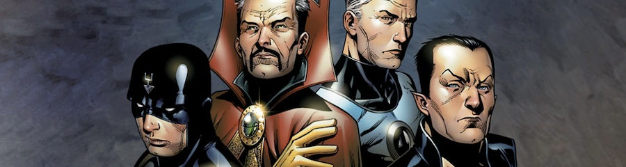
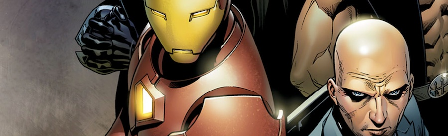

Los tebeos de superhéroes, estas cosas tan coloridas donde unos tipos se visten con mallas chillonas para salir a la calle a hostiarse unos con otros, son un género fascinante. Desde fuera sólo es posible percibirlos quizá como algo vacío de contenido, simple, directamente absurdo o, válgame el hacedor, infantil. Desde dentro, sin embargo, son un género tan profundamente autoreferencial, con una riqueza y un potencial para el entretenimiento tan grande, que la sorpresa nunca acaba.

En unas editoriales más que en otras -- en unos _universos creativos_ más que en otros, podríamos decir -- se trabaja el concepto de la _continuidad_. "Aquello pasó antes que esto. Pero ambas cosas pasaron, y cuando mañana venga menganito a escribir nuevas historias, que tenga en cuenta lo que ya ha pasado hasta ahora". Metemos estos conceptos en una batidora y los agitamos. Durante cuarenta años la coctelera la agitan cientos de escritores distintos, metiendo en ella innumerables personajes. El cóctel resultante es sorprendentemente coherente para lo que podría ser.

Y entonces nos inventamos la idea de la _retrocontinuidad_: "Hace veinte años, aquello que pasó que nadie recuerda, te lo voy a explicar de nuevo escribiendo una nueva historia que encaje con lo anterior, pero añadiendo novedades". [**Nuevos Vengadores: Illuminati**](http://en.wikipedia.org/wiki/Illuminati_(comics)) es el mejor ejemplo posible para explicar esto.

[**Brian Michael Bendis**](http://en.wikipedia.org/wiki/Brian_Michael_Bendis), su creador, una de las estrellas de _Marvel_ y arquitecto de los principales arcos argumentales que han gobernado toda la realidad ficticia de la editorial durante los últimos años, inventó un nuevo supergrupo dentro de la colección _Los Nuevos Vengadores: Los Illuminati_. ¿Y si hace años los más influyentes héroes se hubiesen unido para crear una alianza secreta preparada para responder ante grandes amenazas? Así [**Iron Man**](http://en.wikipedia.org/wiki/Iron_Man) (fundador de _Los Vengadores_), el [**Profesor Xavier**](http://en.wikipedia.org/wiki/Professor_X) (fundador de los _X-Men_), [**Reed Richards**](http://en.wikipedia.org/wiki/Mister_Fantastic) (fundador de _Los 4 Fantásticos_), [**Namor**](http://en.wikipedia.org/wiki/Namor) (Rey de _Atlantis_), [**Rayo Negro**](http://en.wikipedia.org/wiki/Black_Bolt) (Rey de _Attilan_) y el [**Dr. Extraño**](http://en.wikipedia.org/wiki/Doctor_Strange) (Mago Supremo de la Tierra) decidieron empezar a compartir información y reunirse de cuando en cuando, si creían que alguna amenaza se aproximaba. Pasaron cosas, se descubrió el pastel, hubo tortas, lo de siempre.

Pero el concepto era demasiado bueno como para dejarlo estar sin más. Si ese grupo había existido pero nunca habíamos oído hablar de él, ¿qué hicieron durante los otros grandes eventos pasados? Esta miniserie trata de dar algunas pinceladas como respuesta. Los guiones de _Bendis_ y _Brian Reed_ nos cuentan cómo nuestros héroes se pusieron de acuerdo tras la **[Guerra Kree-Skrull](http://en.wikipedia.org/wiki/Kree-Skrull_War)** de los setenta, cómo buscaron las gemas del **[Guantelete del Infinito](http://en.wikipedia.org/wiki/Infinity_Gauntlet_(weapon))**, reinventan todo lo sucedido durante las recordadas [**Secret Wars**](http://en.wikipedia.org/wiki/Secret_Wars) de los ochenta -- en un ejercicio de retrocontinuidad que cambia todo lo que los lectores sabíamos --, cómo influyeron en el nuevo [**Marvel Boy/Capitán Marvel**](http://en.wikipedia.org/wiki/Noh-Varr) y cómo se reunieron al comienzo de [**Invasión Secreta**](http://en.wikipedia.org/wiki/Secret_Invasion), el macro-evento de 2008 de la editorial. El arte de [**Jim Cheung**](http://en.wikipedia.org/wiki/Jimmy_Cheung) es excepcional, el indicado para un tebeo de estas características, a medio camino entre el clasicismo necesario para evocar las historias originales y la moderna espectacularidad requerida por la grandeza de los eventos narrados, con el estilo de línea clara de un, por ejemplo, _John Romita Jr_.

La única pega achacable es la obvia: su absoluta autoreferencialidad. No hay disfrute posible para el no-iniciado. Sin embargo, para el lector de tebeos _Marvel_ la delicia de revisitar lugares y momentos descubriendo nuevos detalles es impagable, una sucesión de capítulos repletos de épica y emoción.