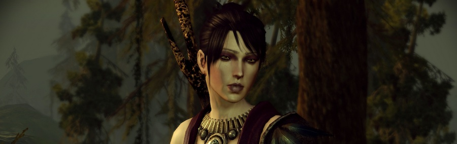

No he escrito por aquí en lo que llevamos de año, algo más de mes y medio, y es que uno de los escasos principios autoimpuestos que me marqué al retomar este _blog_ fue el de mejorar mi escritura. No mucho, no seamos presuntuosos, pero algo. Y pocas cosas hay que ayuden más a la escritura que tener algo que contar. Si no escribo, es que no tengo nada interesante que decir, cabría suponer. No será que no he leído libros y tebeos, que no he visto películas y que no he jugado a juegos. No. Será simplemente que la mediocridad no inspira.

Estas pasadas navidades retomaba una partida abandonada al primer [Dragon Age](http://en.wikipedia.org/wiki/Dragon_Age:_Origins), alabado juego de pseudo-rol de [Bioware](http://en.wikipedia.org/wiki/BioWare)/EA, años después de haberla dejado a medias. Unas horas de reencontrarme con los controles, rememorar las tramas envueltas alrededor de mi personaje hasta recordar que no importan y repetir las mismas acciones una y otra vez hasta ver los títulos de crédito finales. Y desde entonces un borrador de _post_ imposible de enfocar.

__

_Bruja con la que tener tus más y tus menos. En este juego te puedes llevar a la gente a la cama. Da logros._

Una lista de todas las cosas que están mal en este juego sería extensa, aburrida y pretenciosa. Preguntas retóricas sobre cómo algo tan simple puede ser juego del año acabarían enfocando al imperio del márketing de [Electronic Arts](http://en.wikipedia.org/wiki/Electronic_Arts), amos y señores del mal.

Nada queda de original, con un _game design_ reciclado de [Mass Effect](http://en.wikipedia.org/wiki/Mass_Effect_(video_game)), una ambientación default de _Dungeons & Dragons_, un motor tecnológico anclado en los años 80 en los que había que rodear las sillas y los charcos, una narrativa maniquea que enfrenta al mal absoluto y el espejismo del árbol de elecciones y el juego no lineal donde sólo se puede escoger entre distintas opciones A o B que terminarán siendo irrelevantes para el gran esquema de las cosas que se están contando.

Nada está especialmente mal. Entendedme. Nada está MAL en mayúsculas. Pero todo es mediocre, todo es reciclado, sin ningún punto de apoyo en el que anclar la creación de una obra, como si de un producto diseñado por comité estuviéramos hablando. Un producto de diseño que trata de contentar a un nicho demográfico concreto. Un producto de márketing vacío, sin personalidad ni características definitorias propias.

Y por eso no escribo. Porque para esto mejor estamos callados. Y sin comprar.