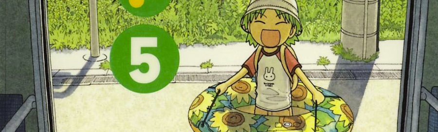

Se me hace difícil pensar en un tebeo _mainstream_ con un humor tan blanco como para poder poner ejemplos de qué es este [**¡Yotsuba!**](http://en.wikipedia.org/wiki/Yotsuba%26!) de [Kiyohiko Azuma](http://en.wikipedia.org/wiki/Kiyohiko_Azuma). Quizá las más inocentes tiras de _Calvin & Hobbes_ puedan servir de marco de referencia, con ese humor de sonrisa tímida que da el ver la realidad desde una perspectiva ya perdida.

_¡Yotsuba!, de Kiyohiko Azuma. Portada del quinto tomo._ {.center}

_Yotsuba_ es una niña de cinco años que vive con su padre adoptivo, y su historia comienza cuando se mudan a un nuevo barrio. Cada capítulo nos cuenta cómo esta niña conoce cosas nuevas con la imparable curiosidad propia de su edad: sus vecinos, montar en bicicleta, visitar una granja o hacer la compra.

Un arte de línea clara, heredero sin embargo del _Shonen_ (el autor venía de dibujar [_Azumanga Daioh_](http://en.wikipedia.org/wiki/Azumanga_Daioh), también publicada en nuestro país), y una narrativa pausada donde se puede disfrutar de cada capítulo prácticamente de forma independiente, aunque con pequeños detalles que desgranan poco a poco el carácter de cada uno de los personajes secundarios de la serie y ayudan a disfrutarla como un todo.

Once tomos (por ahora) en su edición original en japonés, de los que [Norma Editorial](http://www.normaeditorial.com/catalogo.asp?S/563/0/0/yotsuba) lleva publicados ya los diez primeros en castellano.