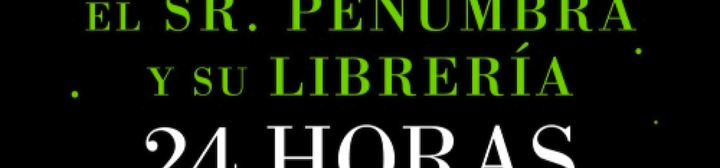
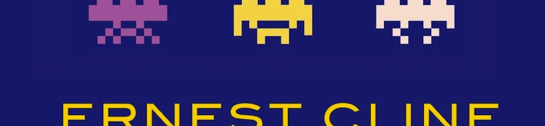

Los hados han querido que durante el último mes leyera o leyese dos novelas tan alejadas en ambientación como cercanas en sus detalles decorativos. Y algunos pensamientos me han asaltado durante sus lecturas, de particular importancia los relacionados con las ganas de arrancarme los ojos que dan sus lamentables traducciones al castellano, sus desvergonzadas ediciones y lo mucho que a posteriori traductores y editores tratan de dignificar sus profesiones. Como el _blog_ es mío, aquí pagan justos por pecadores, el todo por la parte, y esas cosas.

[**El Sr. Penumbra y su librería 24 horas abierta**](http://en.wikipedia.org/wiki/Mr._Penumbra%E2%80%99s_24-Hour_Bookstore) (_Mr. Penumbra's 24-Hour Bookstore_, de Robin Sloan)

Aunque esta anécdota no sume ni reste a la obra, gracias a que su escritor formó parte del equipo original de _Twitter_ me enteré yo de su existencia, a través de algún perdido _blog_ sobre desarrollo de _software_. Y de ahí el márketing, ya se sabe, puede hacer que esa información llegue a tus oídos quizá muy exagerada para llamar la atención sobre el autor.

En la novela, un diseñador/programador en paro (diría _desarrollador-front_, pero sólo me iban a entender los del gremio) acaba atendiendo el turno de noche de una librería abierta 24 horas, en la que parece que nunca compra nadie. Sólo algunos clientes, raros de por sí, vienen a recoger en préstamo aún más extraños libros, con sus textos codificados, conformando una trama de misterio que acaba con centenarias organizaciones secretas, guiños sencillos sobre tecnología y _fan-service_ en forma de personajes _geeks_ para esparcimiento del lector objetivo. Muy sencilla novela _best-seller_ de consumo rápido. Todo correcto hasta aquí.

Nos encontramos entonces con un personaje experto en efectos especiales que trabaja en la industria de luz y magia (por _Industrial Light & Magic_, probablemente la más conocida empresa del sector. Sólo hay que buscar en _Google_). Un amigo con quien el protagonista había compartido aficiones de jóvenes, y había sido su Máster de las mazmorras (título de educación superior que sustituye a _Dungeon Master_, que nunca se traduce). Chistes como "eso es algo tan conocido como el peso atómico del carbón" (por carbono, que ya hay que ser animal para confundir en inglés _carbon_ y _coal_). Constantes meteduras de pata que te sacan de la narración y que habrían sido perfectamente solucionadas usando un arcano aparato de magia oscura como puede ser un ordenador conectado a internet.

[16€](http://www.bookdepository.co.uk/El-Sr-Penumbra-y-Su-Librer-24-Horas-Abierta-Robin-Sloan/9788499185880) en castellano con esta traducción de rocaeditorial. En inglés [13](http://www.bookdepository.co.uk/Mr-Penumbras-24-hour-Bookstore-Robin-Sloan/9781782391197) o [9,50](http://www.bookdepository.co.uk/Mr-Penumbras-24-Hour-Bookstore-Robin-Sloan/9781250037756), según la editorial, en la puerta de tu casa. En inglés incluso hay un efecto fluorescente en la portada.

**[Ready Player One](http://en.wikipedia.org/wiki/Ready_Player_One)** (de Ernest Cline)

Uno de los grandes ventas del género fantástico durante el último par de años según tengo entendido (información sin contrastar que podría estar inventada; nunca lo sabrás, amigo lector), y gran exponente de lo que a mi entender va a convertirse en uno de los grandes nuevos géneros fantásticos durante la próxima década: la aventura dentro de un entorno virtual. Desde la seminal _Tron_ hasta los actuales pequeños imperios multimedia del género como _.Hack_, _Sword Art Online_ o este _Ready Player One_ del que ya se habla de una película, intuyo que cada vez vamos a tener más obras ambientadas en estos dobles mundos reales y virtuales.

Aquí un joven adolescente forma parte de la búsqueda de un tesoro dentro del más famoso juego/entorno de su tiempo, un no muy lejano futuro de crisis energética, dejadez social y pobreza generalizada, donde se compite por conseguir la herencia indicada en el testamento del anciano creador de este gran juego de juegos. Desde este punto de partida, toda la novela es un inmenso _fan-service_ dedicado a la generación que creció durante los años ochenta (que fueron la infancia del fallecido), con continuas apariciones-homenajes-cuidado-que-bordeamos-el-pleito de naves espaciales, magos, dibujos animados, películas de _John Hughes_, música pop, juegos de rol, robots gigantes, videojuegos clásicos y un larguísimo etcétera. Todo muy pajeril, todo muy entretenido, pero _fan-service_ al fin y al cabo; en su mayor parte son detalles que jamás aportan nada a la historia o a los personajes, pero ahí están. Lo que es la narración, sencilla y simple, homenaje a su vez a las historias de la época, con protagonista adolescente en el instituto, aventura y riesgo, enamoramiento de la chica inalcanzable y villano maniqueo. No se puede esperar algo distinto, y tampoco es que eso sea malo.

Pero. Pero. En un libro como este, es INDISPENSABLE que el traductor tenga conocimiento sobre la materia que está traduciendo, porque si no puede crear un desaguisado monumental. No puedes traducir _Dungeons & Dragons_ a veces como _Dragones y mazmorras_ y a veces como _Mazmorras y dragones_. No puedes decir que los gigantescos robots japoneses son mecanos en lugar de _mechas_. No puedes transformar a los replicantes de _Blade Runner_ en réplicas. Y un largo y enervante etcétera. Por dejadez, hasta se les ha colado algún corta y pega y sustituye en todo el texto que ha dejado mayúsculas en mitad de determinadas palabras. Mala labor de traductor, nula labor de editor.

[17€](http://www.bookdepository.co.uk/Ready-Player-One-Ernie-Cline/9788466649179) en castellano, en esta horrenda traducción de Ediciones B. [8 en tapa blanda](http://www.bookdepository.co.uk/Ready-Player-One-Ernest-Cline/9780099560432) o [14 en tapa dura](http://www.bookdepository.co.uk/Ready-Player-One-Ernest-Cline/9780307887436) en inglés. Yo sabía a lo que me arriesgaba e iba a comprar el libro en su idioma original pero se me adelantaron y me llegó como regalo.

Si admitís un consejo de este, vuestro amistoso vecino: gastad el dinero en unas buenas clases de inglés. Tendréis mejores libros, mejores tebeos y mejores actuaciones en series y películas. Y en lugar de llorar el fallecimiento de narradores/dobladores (que es una pena, todo sea dicho), disfrutaréis de Eastwood y su "[_Go ahead. Make my day_](http://www.youtube.com/watch?v=Flt9K8vlJGE)", Schwarzenegger y su "[_Hasta la vista, baby_](http://www.youtube.com/watch?v=KGsTNugVctI)", James Earl Jones y su "[_I'm your father_](http://www.youtube.com/watch?v=A6JnGTXCkHA)" o Sean Connery y su "[_Bond, James Bond_](http://youtu.be/3nxG09xHhro?t=1m14s)", así como de un trillón de libros como los que he mencionado más arriba... u otros mejores.