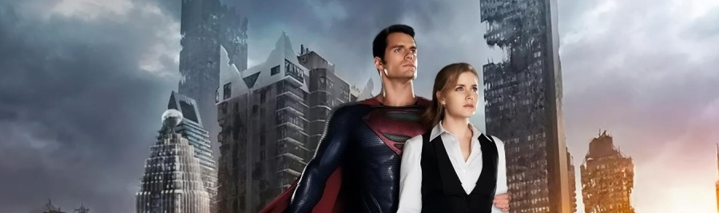

En estos tiempos de glorificación de cualquier manifestación de la cultura pop, se hace difícil desmontar los constructos mentales autodefensivos que cada consumidor realiza para proteger "sus" obras. Tan fácil es para el _fan_ argumentar una cosa como todo lo contrario.

En esta [**Man of Steel**](http://www.imdb.com/title/tt0770828/) ([_Zack Snyder_](http://www.imdb.com/name/nm0811583/), 2013), que no es _Superman_, teníamos todas las premisas para hacer algo importante, exactamente igual que las tuvimos en _Superman Returns_ y aquello desembocó en una película que ya nadie recuerda.

_Un señor con una S que no es de Superman y una señora que no sé qué hace en la película_

Tras un primer acto levemente prometedor, pese al Nolanismo imperante de cielos grises, colores oscuros y un impostado dramatismo que alcanza niveles insoportables, todo se desmorona con una retahíla de decisiones argumentales inconexas. Los personajes secundarios se demuestran forzados -- una _Lois Lane_ que sólo está ahí para que algún holograma pueda explicarle lo que está pasando y el espectador se entere -- o directamente inexistentes -- como toda la plantilla del _Daily Planet_, que podría haber sido eliminada del metraje sin sufrimiento alguno --.

El ritmo se va viniendo abajo y ya nunca logra remontar. Se intentan forzar emociones en el espectador con muertes mal orquestadas y planificadas, se hace necesario que los diálogos expliquen continuamente lo que sucede y, cuando ya no queda por dónde cogerlo, comienza una orgía de _destruction porn_ que cansa al espectador, deseoso de que termine el sufrimiento y las escenas repetitivas (visto un edificio caerse, vistos todos). Hay que analizar esta última frase, escrita por un _fan_ declarado del cine de _Michael Bay_. Hay un cine sincero que sabe lo que vende y lo que promete, y hay un cine pretencioso, deseoso de alcanzar el reconocimiento de los críticos y que no lo consigue. _Man of Steel_ entra directamente en esta segunda categoría. Ni respeta al personaje ni lo reinterpreta correctamente. Ni consigue un drama aceptable ni una buena película de tíos en pijama dándose tortas como panes.

Y tras esto, sólo queda Internet y su polarización absoluta en las opiniones sobre la película. Un [metacritic](http://www.metacritic.com/movie/man-of-steel) (¡hereje!) de 55 por parte de los críticos y 8.2 de los _fans_. Poco queda que explicar tras esas cifras. Si no te gusta la película eres una persona gris que piensa todo demasiado y no sabe disfrutar del cine palomitero. Si te gusta eres un descerebrado _fan_ del personaje. Así es Internet.