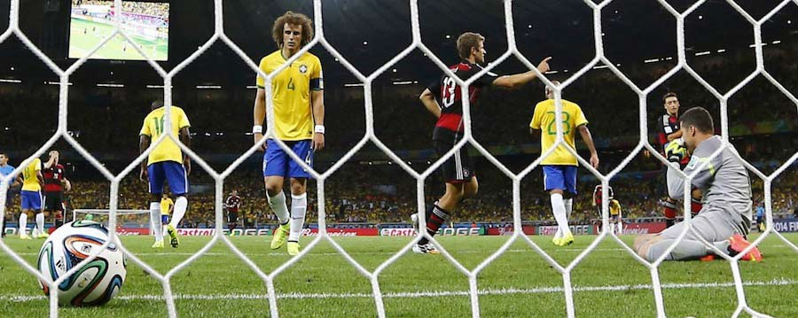
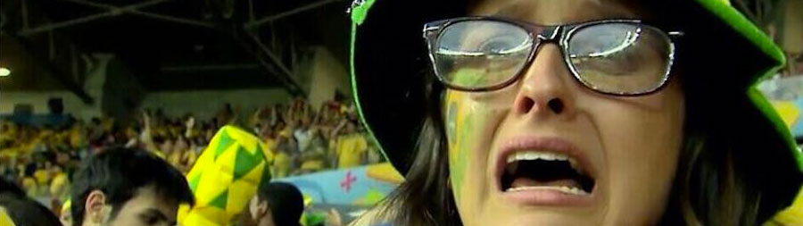

Decía alguien con más experiencia a sus espaldas que yo que a través del fútbol se podía entender el mundo, a sus gentes y sus costumbres. Y para eso están los mundiales, para que un grupo de chavales nacidos en unas coordenadas geográficas y temporales (relativamente) cercanas defiendan la bandera y el escudo representativos de unas líneas imaginarias dibujadas sobre un mapa. Y para retratar a los ciudadanos.

_Foto vía [Business Insider](http://www.businessinsider.com/photos-brazil-loss-germany-2014-7)_

Veo difícil explicar a mis nietos que hay cosas que no suceden porque sí. Que si Brasil y Alemania llevan tantas estrellas en el pecho es por algo. Y que, aunque parezca inexplicable, en un campeonato que sólo se repite cada cuatro años, donde en cada evento los jugadores y los entrenadores son, y pueden y deben ser, distintos, las tradiciones sin embargo se mantienen. Los estilos que establecen las naciones se reflejan en el balón y se entienden. Si pintásemos las camisetas de blanco y negro, como una partida de ajedrez, y no supiéramos en qué lado juega cada uno, desde un lejano avión identificaríamos el toque de Brasil, las bandas de Argentina, la defensa de Italia y el control de Alemania. Y los demás, los que han visto la aparición de un favor divino y bordan estrellas en la camiseta, se sientan y miran, esperando que la suerte vuelva a aparecer.

Cuando no es la suerte la que habla, sino la tradición, la historia futbolística de una nación, un 7-1 no es una nota a pie de página en un libro de recortes. Cuando no es un equipo menor el que tiene la desgracia de volver cabizbajo a casa, cuando no hay casa a la que volver porque es en tu hogar donde la humillación ha tenido lugar, no hay dónde esconderse. Es asunto de interés nacional. Es antes y después. Algo que no debía, no podía suceder, y ha sucedido. Una generación entera de futbolistas y aficionados que crecerá recordando esto.

_Captura de pantalla de la retransmisión televisiva_