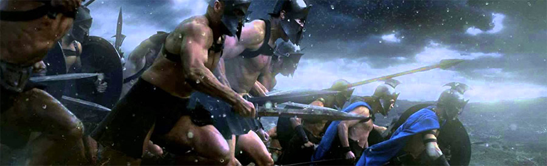
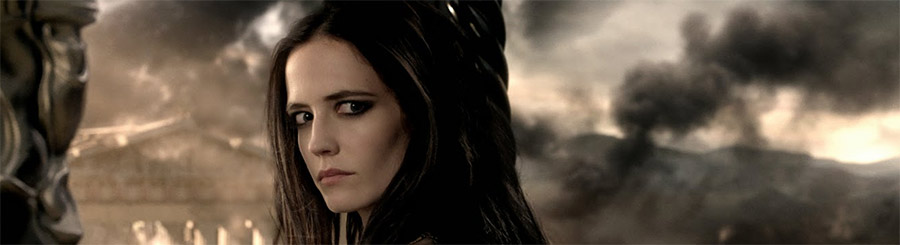

Después del tremendo éxito que supuso _[300](http://www.imdb.com/title/tt0416449/)_ (la película basada en el tebeo), su continuación _[300, el origen de un imperio](http://www.imdb.com/title/tt1253863/)_ (la otra película también basada en el creo que aún inédito tebeo) se me antoja un experimento fallido en… se me antoja una mala película.

_En realidad luego todo sucede en barcos y es menos emocionante._

No vale ya ni como poco sutil metáfora militarista de las diferencias entre oriente y occidente, como intentaba hacer su predecesora, puesto que se pierde en la identificación estereotipada de los personajes. No son ya los espartanos los defensores de la democracia, sino los orgullosos militares que no quieren ayudar a los verdaderos demócratas. No están los malvados persas ya liderados por un icónico y hasta totémico Jerjes, que aquí incluso se humaniza levemente, sino que aparece la nueva figura de la general persa-que-en-realidad-es-ateniense que confunde al espectador al tener un origen (de arquear ceja), un trauma (el ya habitual si hay un personaje femenino), y un deseo prohibido (y eso ya tal). Y el "_a ver si los griegos no van a ser tan buenos entonces_" que termina de desdibujar cualquier influencia del [_Frank Miller_](http://en.wikipedia.org/wiki/Frank_Miller_(comics)) desatado de las últimas décadas.

_También sale desnuda de modo completamente gratuito, pero este post es para todos los públicos._

Se queda uno pensando: ¿qué estoy viendo exactamente? La fuerza estética de la primera película queda diluida, parcialmente por estar peor hecha y por repetición de esquemas ya en muchos largometrajes desde entonces. El argumento se pierde, los personajes se desdibujan, el protagonista no mantiene la posición de liderazgo cinematográfico que tenía el Leónidas de Gerard Butler.

Todo mal.