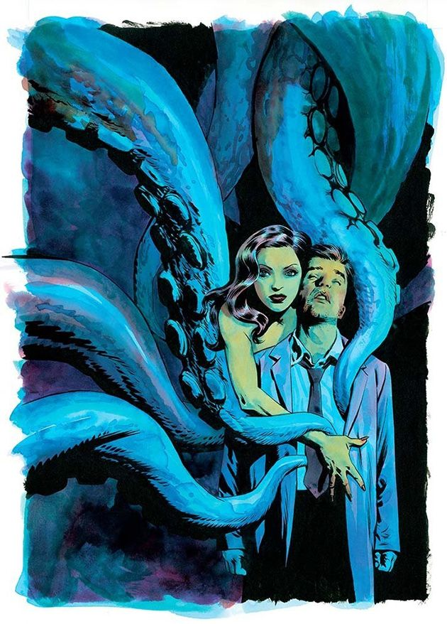

Un punto de unión entre el terror cósmico _lovecraftiano_ y el género negro (como no podía ser de otra forma, con el tándem autoral formado por [Brubaker](https://en.wikipedia.org/wiki/Ed_Brubaker) y [Phillips](https://en.wikipedia.org/wiki/Sean_Phillips)). El primer tomo, **La muerte me persigue**, se construye en base a habilidosos _flashbacks_ hacia la década de los 50, a una San Francisco de policías corruptos y cultos secretos, de violencia y oscuridad. Apropiada lectura para las noches veraniegas que deja con ganas de más.

[Fatale Volumen 1: La muerte me persigue](http://www.amazon.es/gp/product/8490243670/ref=as_li_ss_tl?ie=UTF8&camp=3626&creative=24822&creativeASIN=8490243670&linkCode=as2&tag=neverbot-21): En castellano editado por **Panini** en tomo de tapa dura (15€), en inglés por **Image Comics**: [Fatale Volume 1: Death Chases Me](http://www.amazon.es/gp/product/1607065630/ref=as_li_ss_tl?ie=UTF8&camp=3626&creative=24822&creativeASIN=1607065630&linkCode=as2&tag=neverbot-21) (unos 16€ en Amazon, menos si compras a BookDepository a través de Amazon).
