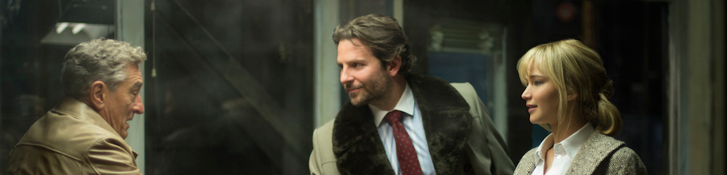
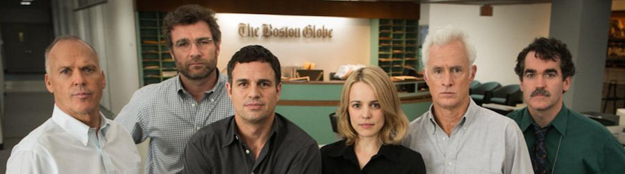

**[Joy](http://www.imdb.com/title/tt2446980/)** (_David O. Russell, 2015_)

No habría dado para mucho más que telefilme de sobremesa, pero eh, si también con eso ganó un Oscar [Sandra Bullock](http://www.imdb.com/name/nm0000113/) con [The Blind Side](http://www.imdb.com/title/tt0878804/), una película diseñada para mayor gloria de [Jennifer Lawrence](http://www.imdb.com/name/nm2225369/) tenía que convencer a crítica y público. Pese a ser muy correcta a mí particularmente me ha parecido prescindible.

**[Spotlight](http://www.imdb.com/title/tt1895587/)** (_Tom McCarthy, 2015_)

Poco más puedo decir también de Spotlight, realmente brillante a nivel técnico, con un ritmo muy bien llevado... pero que, al final, acaba siendo un ¿_docudrama_? ¿un _biopic_ de una investigación periodística? Me pareció que le faltaba algo de conflicto a una narrativa muy de "investigamos esto, publicamos la noticia, fin".

**[Before we go](http://www.imdb.com/title/tt0443465/)** (_Chris Evans, 2014_)

Y al final sin embargo me sorprenden las tonterías más desconocidas, como este experimento de [Chris Evans](http://www.imdb.com/name/nm0262635/) en un descanso entre _capitanes américas_ y _vengadores_, en labores de dirección, producción y actuación. Una historia romántica sin caer en la ñoñería fácil, con final abierto y varios momentos curiosos. Pasó y pasará desapercibida, porque no es más que una película de relleno y, sin embargo, ahí le veo su virtud.