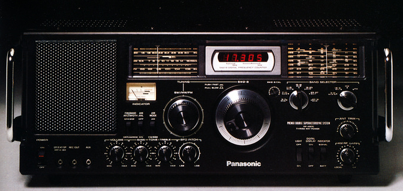
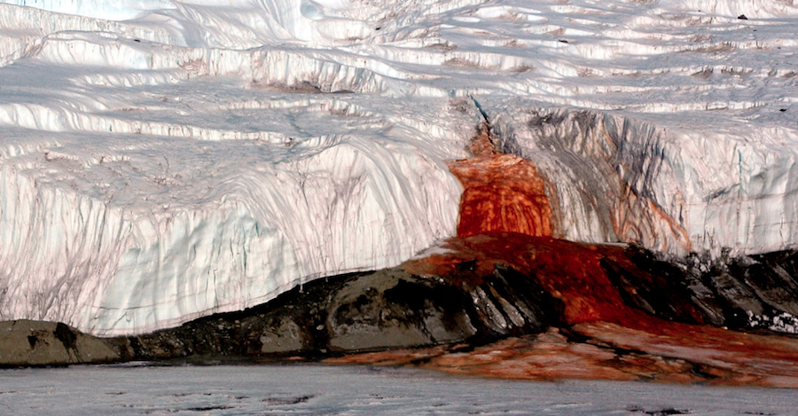
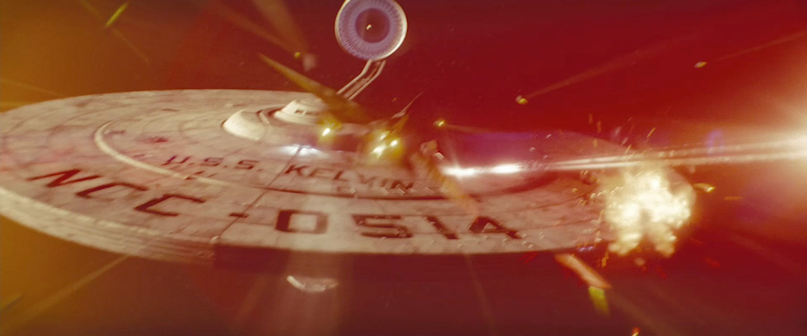

Recupero aquí (mucho tiempo después, en realidad). El primer (y único) envío a la lista de correo que mencionaba en el post anterior. No tuvo largo recorrido, desde luego, pero sirvió como ejercicio de programación para aprender a editar y enviar correos y gestionar una lista de recipientes. *La experiencia es el peine que nos da la vida cuando nos quedamos calvos.*

---

**Algunas cosas interesantes que he encontrado en Internet durante esta última semana:**

Echando un vistazo a [terremoto.net](http://www.terremoto.net/), el blog de Javier Cañada, un diseñador de interacción al que suelo leer, encontré un par de artículos interesantes sobre radios de onda media. Sí, estas cosas siguen existiendo ya bien entrado el siglo XXI, y me han recordado curiosidades de cuando aún era un crío y desde mi pueblo se recibían las emisiones de lejanas tierras... que en aquellos tiempos probablemente fueran en algo tan incomprensible con aquella edad como podía ser el inglés.

Un pequeño artículo con [recomendaciones sobre receptores](http://www.terremoto.net/blog-es/onda-corta) y otro algo más extenso y en inglés, [publicado en medium](https://medium.com/@javiercanada/travel-in-time-and-space-for-less-than-50-80d441e32642#.bqm4b31ic).

---

En el fantástico blog [Fronteras](https://fronterasblog.com/), que nunca me cansaré de recomendar, un artículo sobre [las cataratas de sangre de la antártida](https://fronterasblog.com/2016/09/26/las-cataratas-de-sangre-de-la-antartida/). No nos asustemos todavía, el macabro nombre sólo hace referencia al color rojizo de sus aguas. Nunca está de más saber el porqué de esos colores.

Foto de [Peter Rejcek](https://photolibrary.usap.gov/PhotoDetails.aspx?filename=BLOOD_FALLS.JPG)

---

Y que no haya un día sin alguna curiosidad subcultural. Gracias a [io9](http://io9.gizmodo.com/), un lugar en el que perder el tiempo hasta límites insospechados, leía que en algún [próximo cómic de Star Trek](http://io9.gizmodo.com/the-new-star-trek-comic-will-have-borg-invade-the-kelvi-1786891491) los Borg aparecerían en la línea temporal Kelvin. [Wat?](http://i0.kym-cdn.com/photos/images/newsfeed/000/173/576/Wat8.jpg?1315930535) Asumamos que el lector sabe lo que es Star Trek, y conoce (o no, es irrelevante para el caso) quiénes son los Borg. 

Daría para otro artículo interesante el explicar quiénes son los Borg, y cómo sería posible que su aparición en series y películas viniera tan de atrás como [la película original de Star Trek](http://www.imdb.com/title/tt0079945/) de 1979 de una forma que para nada parecía presagiar un desastre tan grande para la galaxia... pero esa es una historia para otro momento y otro lugar.

La curiosidad que yo venía a contar es esa de "la línea temporal Kelvin". Como todos sabéis (deberíais) en 2009 se produjo un... erm... reboot... recomienzo... un cambio en el universo Star Trek gracias a un viaje en el tiempo, creando una nueva línea temporal. En esta "realidad" nada de lo que conocemos (*The original series*, *The next generation*... nada) ha sucedido, y todo vuelve a contarse desde que Kirk y Spock son jóvenes. 

[Esta primera película de 2009](http://www.imdb.com/title/tt0796366/) fue dirigida por [J. J. Abrams](http://www.imdb.com/name/nm0009190?ref_=tt_ov_dr). El abuelo de este señor se llamaba *Henry Kelvin*, aparentemente fue una figura de importancia durante su juventud, y desde entonces ha utilizado como guiño y homenaje la palabra Kelvin [en todas sus producciones](http://the-odi.blogspot.com.es/2008/10/abrams-explains-use-of-kelvin-in-his.html), en forma de huevo de pascua escondido. Tuvimos la nave U.S.S. Kelvin en [la primera película](http://www.imdb.com/title/tt0796366/), el [Kelvin Memorial Archive](https://www.youtube.com/watch?v=N7JGgdFRero) en [Into Darkness](http://www.imdb.com/title/tt1408101/). Y finalmente el *fandom* [ha acabado bautizando](http://screenrant.com/star-trek-jj-abrams-kelvin-timeline/) a esta "línea temporal" como la **línea temporal Kelvin**.

Nunca te acostarás sin saber una cosa más.