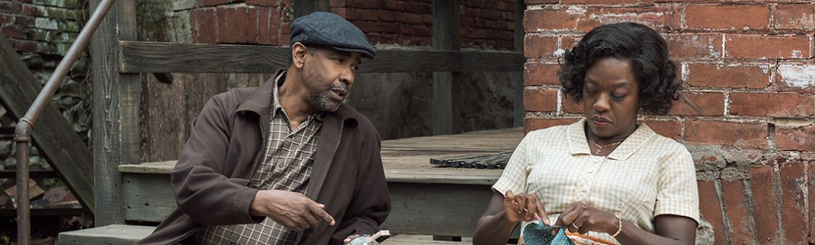
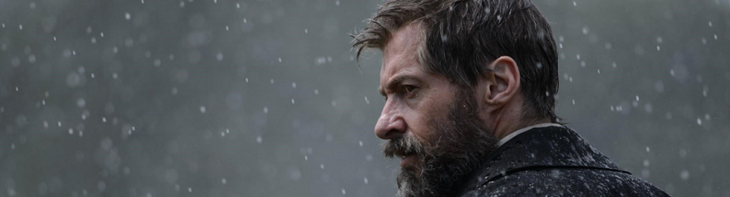
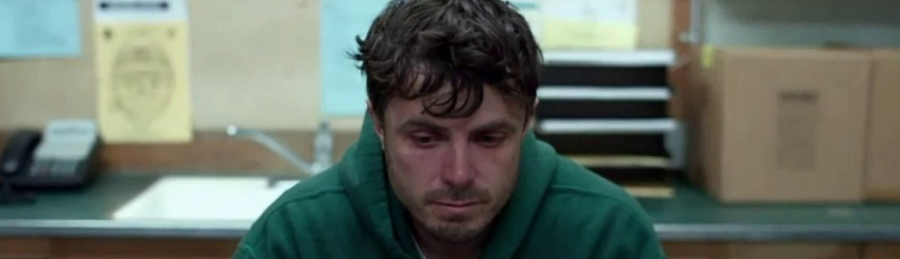

**[Fences](http://www.imdb.com/title/tt2671706/)** (_Denzel Washington,_ 2016)

Magnífica interpretación de todos los actores, tanto principales como secundarios, en una historia que dependerá de en qué se estuviera fijando el espectador. Segregación racial, alienación del individuo en la sociedad de trabajo, sueños truncados, enfrentamiento generacional, pérdida de la individualidad y el propósito dentro del matrimonio... todo temas felices.

O, como leí en [una crítica en letterboxd](https://letterboxd.com/film/fences-2016/):

> _denzel washington needs to shut the hell up: the movie (2016)_

No parece una adaptación realmente brillante al cambiar de medio. Sigue pareciendo una obra de teatro y probablemente sea más disfrutable de ese modo.

**[Logan](http://www.imdb.com/title/tt3315342)** (_James Mangold_, 2017)

Dos primeros actos excepcionales, mezcla de _western_ crepuscular y _road movie_ (un euro por cada vez que alguien haya escrito "_western_ crepuscular" hablando de _Logan_ y sería rico). Un tercer acto donde al guión, la dirección y la fotografía se les olvida todo lo que se ha hecho hasta ese momento y volvemos a una película de los _X-Men_ tan absurda como la docena de películas anteriores. Que no estaría mal de no llevar una hora de metraje viendo otra cosa distinta.

Casi. Casi lo conseguimos esta vez.

La culpa la tiene la barba de [Hugh Jackman](http://www.imdb.com/name/nm0413168). Desde el minuto en que se afeita en la película todo va cuesta abajo. Hemos encontrado su talón de Aquiles.

**[Manchester by the Sea](http://www.imdb.com/title/tt4034228/)** (_Kenneth Lonergan_, 2017)

Excepcional representación de la destrucción del alma de un ser humano, y cómo algunos eventos vitales pueden llegar a rompernos más allá de toda reparación.

**[Silence](http://www.imdb.com/title/tt0490215/)** (_Martin Scorsese_, 2016)

Insoportable.

Pero tampoco voy a mentir, sólo vi las dos primeras horas de película, a lo mejor luego remonta y resulta ser una fantástica alegoría sobre las consecuencias del colonialismo católico en otras culturas, pero no me lo estaba pareciendo. Si versase sobre una religión "menor" diríamos que es propaganda.

Salvando estas cosas, el problema de que yo no soy su público objetivo, realmente me parece difícil verle virtudes.