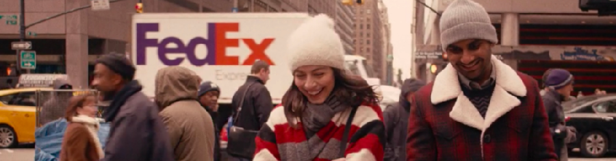
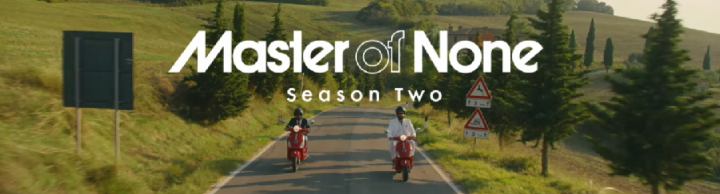

En esta moderna sociedad de información inmersa en tremendas campañas de _marketing_, la dictadura del jaip (_hype_) hace que todo el mundo escuche, vea y lea lo mismo. Que a veces está bien, a veces realmente tiene calidad. Pero ocupados como estamos en hacer caso sólo a lo _trendy_, en las profundidades de los catálogos de editoriales y productoras se quedan maravillas que no llegan a ser descubiertas por una gran parte del público a menos que pongas grandes rótulos de neón parpadeante diciendo "tienes que ver esto".

Y así estamos. Mientras todo Madrid se empapela con anuncios del regreso de [Narcos](http://www.imdb.com/title/tt2707408/) (de la que he visto únicamente una temporada y no más, Santo Tomás; aunque el tema queda para otro momento), Netflix produce joyas como **[Master of None](http://www.imdb.com/title/tt4635276/)** de la que no había oído hablar en mi vida.

Es una serie creada y escrita por [Aziz Ansari](http://www.imdb.com/name/nm2106637/), uno de los protagonistas de [Parks & Recreation](http://www.imdb.com/title/tt1266020/) (que tampoco ha tenido mucha fama por estas tierras), en uno de esos claros casos de "como no me dais papeles que me interesen, ya me los hago yo". Esto le da a la serie una cierta aura de obra de autor, pero a la vez de producto creado para engrandecer la imagen de una persona concreta, y a veces se nota. Pero tampoco mucho.

Y sí, es una serie de un montón de [jasps](https://www.youtube.com/watch?v=rJrsUnxLlpo) _hipsters_ reuniéndose para comer en sitios guays de la ciudad, aunque esta sea sólo la excusa para plantear conversaciones y temas, a razón de uno por capítulo, y ver cómo los enfocan distintas personas de esta (nuestra) generación. De hecho es esta una de las razones que ha esgrimido Ansari para responder que no sabe cuándo (o si sucederá) una tercera temporada, el haberse quedado quizá sin temas que hablar alrededor de una mesa acerca de la vida en la ciudad.

Dicho esto.

Seriaza. Encantadora a todos los niveles, implicada con distintos temas generacionales, solucionando limitaciones de presupuesto y producción con una creatividad desbordante, y ampliamente premiada. Sólo dos temporadas de diez capítulos cada una, rápida de ver y que deja con ganas de más. Esperemos que se animen con una tercera el año que viene, y descubramos qué pudo suceder en ese magnífico final abierto de la segunda temporada.