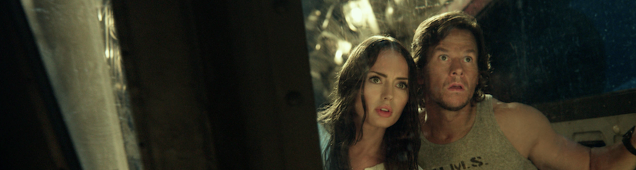
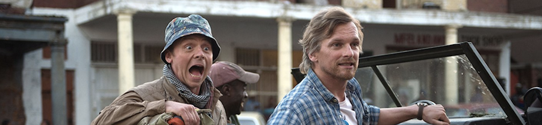

Con un título de post que queda un poco pornográfico en esta trigésima entrada, damos un repaso rápido a algunas de las últimas películas que he visto.

**[Bone Tomahawk](http://www.imdb.com/title/tt2494362/)** (_S. Craig Zahler_, 2015)

Un _western_ durante dos actos que se transforma en una película de horror con toques de _gore_ en el tercero. Sin avisar. Sin paños calientes. Sin venir a cuento. Esto tiene su público y la película ha cosechado buenas críticas dentro de ese _fandom_ concreto, pero horrendas fuera, porque los toques de fantástico no son capaces de maquillar un ritmo lento, unos personajes desdibujados y un escaso argumento.

Me desquitaré leyendo algún tomo de _Blueberry_ y viendo algún otro _western_ durante la semana.

**[Baby Driver](http://www.imdb.com/title/tt3890160/)** (_Edgar Wright_, 2017)

[Nicolas Winding Refn](http://www.imdb.com/name/nm0716347/) lo hizo mejor con [Drive](http://www.imdb.com/title/tt0780504/), sobre todo porque a Baby Driver se le olvidó no resultar tan expositiva en pequeños detalles, en contarnos historias de más que nos sobraban y que a la larga empantanan ligeramente una película que, por lo demás, resulta de impecable factura. Y es que es una verdad histórica innegable que todas las películas con persecuciones en coche siempre tienen algo interesante; como mínimo las persecuciones en coche. Muy buen ritmo que deja con ganas de más.

**[Transformers: The Last Knight](http://www.imdb.com/title/tt3371366/)** (_Michael Bay_, 2017)

Si digo que fácilmente le sobra una hora de metraje no os estoy contando nada nuevo, porque resulta prácticamente idéntica a las anteriores... y es que ya es la ¿quinta? película de la franquicia. La escalada armamentística ya está completamente fuera de madre, cuando en el 2009 [os contaba por aquí](https://neverbot.com/michael-bay-y-el-exceso-cinematografico-transformers-2/) que **Transformers 2** me parecía un punto de inflexión en el nivel de las barbaridades en pantalla, y sólo ha ido in crescendo desde entonces.

Una cierta parte de mi se apena porque [Michael Bay](http://www.imdb.com/name/nm0000881/) haya pervertido el concepto de Transformer para toda una generación, con robots raros y confusos visualmente, y que aquellas cosas tan bonitas de Hasbro, con tebeos de Marvel y series de Toei se hayan perdido en el recuerdo como lágrimas en la lluvia.

**[Hector and the Search for Happiness](http://www.imdb.com/title/tt1626146/)** (_Peter Chelsom_, 2014)

Un [Come Reza Ama](http://www.imdb.com/title/tt0879870/) de segunda fila, ligeramente más visible por tener algo más de humor ([Simon Pegg](http://www.imdb.com/name/nm0670408/) siempre hará más gracia que [Julia Roberts](http://www.imdb.com/name/nm0000210/)), ligeramente (aún) más pérdida de tiempo por no ser capaz ni de plantear un drama coherente en ningún momento. Prescindible.