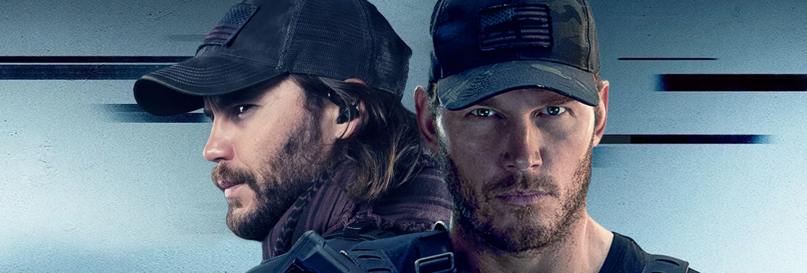

A finales del cretácico, cuando aún escribía en este blog, solía agrupar los pensamientos y opiniones sobre las películas que iba viendo en entradas tituladas "*Reseñas cinematográficas relámpago*", porque era muy habitual ver y escribir sobre cine y se me acababan los títulos ingeniosos. Ahora que hace ya tiempo que estamos en la nueva-nueva edad de oro de la televisión, creo que ya tocaba hacer lo mismo con toda la tele que consumimos, y este "*Movidas catódicas*" es lo que me ha venido a la mente. Por descontado que [rayos catódicos](https://en.wikipedia.org/wiki/Cathode-ray_tube) últimamente vemos pocos, pero oye, que la realidad no te estropee un buen titular.

### [Reacher](https://www.themoviedb.org/tv/108978-jack-reacher) (*Amazon Prime Video*, 2022)

Si vamos a jugar a decir la verdad, los párrafos escritos sobre estas series son intercambiables, y esa es su virtud y su desgracia. Son odas al macho alfa moderno, puestas al día de los James Bond clásicos actualizados en sus escenas de acción, ligeramente rebajados a héroes de clase obrera con vaqueros en lugar de trajes elegantes y [martinis mezclados, no agitados](https://www.youtube.com/watch?v=6SEtPBcsbF4).

Juegan con el deseo interno de (casi) todo hombre de tener que enfrentarse algún día a un problema mayor y poder solucionarlo, poder decir que estuviste a la altura de lo necesario, sea tomando decisiones o soltando un par de guantazos. Y ver esto de vez en cuando está bien, no nos dejemos engañar. Tan enfrentados estamos continuamente a los conceptos de masculinidad *tóxica* que parece que no podamos disfrutar nunca de un poquito de masculinidad *normal* mientras pensamos "*bien hecho Jack, dale otro guantazo a ese anormal de mi parte*".

Por lo demás, pues... si es que ya ni me acuerdo de qué iba esto. Jack llega a un pueblo controlado por una familia poderosa, le meten en un lío, va tirando del hilo (demasiado enrevesado por lo que recuerdo) y al final hay tiros y peleas, *pim pam pum*, y un previsible final caminando hacia la puesta de sol cual moderno *cowboy*, mientras esperamos a la próxima novela, película o temporada. ¿Qué más hace falta?

### [The Terminal List](https://www.themoviedb.org/tv/120911-the-terminal-list) (*La lista terminal*, *Amazon Prime Video*, 2022)

Pues lo mismo. Pero con un SEAL en lugar de un policía militar. Un poquito más de espionaje internacional, una pizca de ex-compañeros de equipo y un aderezo con más tiros y explosiones. Ha recibido peores críticas, y preveo menos posibilidades de que tenga una segunda temporada, pero ambas series tienen finales perfectamente aceptables si no llegan a producirse más episodios.

Como he leído en algún otro lugar, estas series vienen a cubrir un nicho concreto: *Shows For Dads*. El mayor pecado de ambas es no ser películas de hora y media, sencillos *thrillers* de acción, en lugar de series de diez innecesarias horas. Todo esto se puede contar más rápido, pero en la nueva dictadura de **El Algoritmo™** es necesario vender las cosas al peso para detectar que se ven diez productos en vez de uno.

Si las ves, ya sabes a lo que vas. Disfrútalas o no te acerques a ellas, no hay un término medio.
