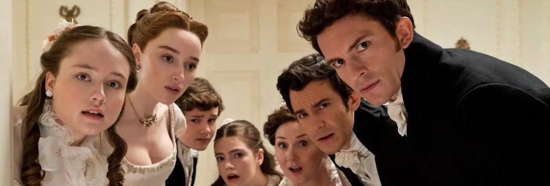
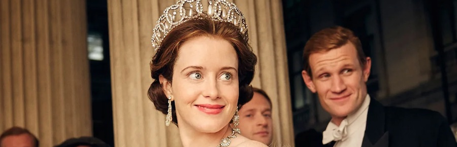
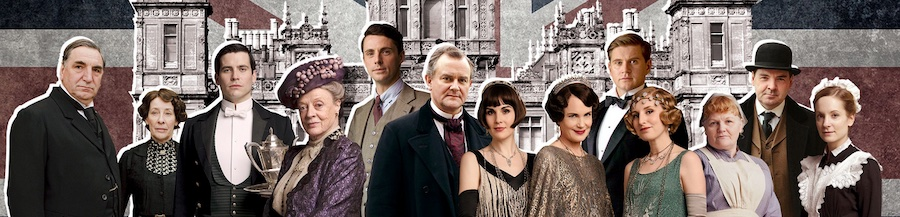

¿Pero qué hago yo consumiendo estas pornografías de la aristocracia más conservadora? Yó qué sé, se me he hace muy fácil interesarme por las noblezas ficticias, leer sobre el árbol genealógico de Galadriel, hija de Finarfin, hijo de Finwë, pero las monarquías reales (qué bien hilado ahí) se me hacen bola.

Puedo sentirme identificado (ya sabéis, ese *poner algo de ti* dentro del personaje para facilitar la inmersión) con un ficticio elfo de varios milenios de edad. Lo hago a través de la labor creadora de su autor, que lo ha hecho *para mí*. ¿Pero cómo sentirse identificado con un marqués, príncipe o similar, basado en alguien **real**? El ficticio *Downton Abbey* de la realidad es un castillo que pertenece a un señor con página propia en la Wikipedia. Se. Me. Hace. Bola.

PERO.

Cuando consigues ignorar todo lo que te está diciendo tu cerebro sobre este 0,1% más alto de la cadena trófica, que historias tan bonicas resultan, ¿no? Hay que intentar juzgar menos, y yo lo intento.

### [Bridgerton](https://www.themoviedb.org/tv/91239-bridgerton) (*Los Bridgerton*, *Netflix*, 2020, 2 temporadas y contando)

Se haría imposible no mencionar el elefante en la habitación del ruido mediático que hizo el casting *United Colors of Benetton*, pero si a las lectoras de las novelas originales les dio igual (o no hicieron el ruido suficiente, porque yo no me enteré), no me va a importar a mí. Tampoco negaré que si la serie fuese un drama histórico *serio*, me chocaría. Pero tiene tanto de comedia involuntaria a veces que es difícil darle importancia.

Y estas cosas del romanticismo del constante "*ay, qué dirán*" se hacen divertidas de ver. Yo la he disfrutado mucho y a la espera estoy de la tercera temporada/precuela.

### [The Crown](https://www.themoviedb.org/tv/65494-the-crown) (*Netflix*, 2016, 4 temporadas)

Es posible que no os hayáis enterado, dada la poca cobertura mediática que tuvo, pero algo sucedió hace poco acerca del fallecimiento de una señora en una isla. En *Netflix* la serie que produjeron hace unos años a modo de biografía dramatizada ha debido ver nuevos picos de audiencia, porque ahí hemos caído nosotros engañados, para echarle un vistazo. Me imagino la sala de control del señor *Netflix* con un medidor de aguja que de repente sube, como una central eléctrica, y así se enteran de que pasan cosas.

Todavía voy por la primera, pero creo que lo que vaya a ir sucediendo no van a ser *spoilers*... en *Titanic* ya sabíamos que el barco se hundía al final, la gracia está en cómo me lo cuentan, no en qué.

### [Downton Abbey](https://www.themoviedb.org/tv/33907-downton-abbey) (*ITV*, 2020, 6 temporadas y 2 películas)

Y llegamos a la madre de todas estas series, una de esas cosas bonitas de lugares comunes y gente afable donde nunca pasa nada malo y puedes refugiarte poniendo un episodio más para sentirte como en casa, ¿verdad? ¿VERDAD?

Sin avisar, y sin necesidad ninguna, al final de la tercera temporada y principio de la cuarta hay un par de baches gigantes que a punto estuvieron de hacerme descarrilar y abandonar la serie. Eso no se hace, que esto no es *Juego de Tronos*. Mal. Yo prefería el paseo en barca de las primeras temporadas al constante *Je ne sais pas* de por qué les pasan cosas malas a esta gente. Y aún así hice de tripas corazón y llegué al final, sólo pendiente de ver esas últimas dos películas a modo de secuelas de la historia original.

Tampoco me puedo quejar mucho, fue un viaje divertido.
