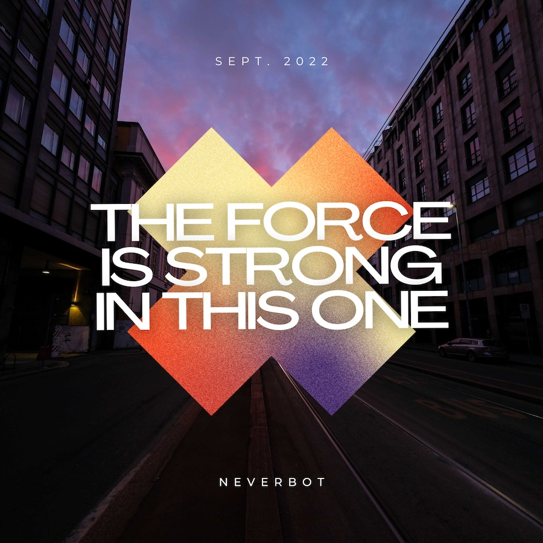

Por dentro soy un señor mayor. Disfruto del placer de consumir música en soportes físicos, en discos de vinilo o CDs. Sigo buscando un buen reproductor/grabador de minidiscs para poder usarlo algún día, y creo que en el año 2022 con eso está todo dicho.

Sin embargo, una gran cantidad de lo que consumimos es en un formato digital, archivos o *streaming*. En una de las dos opciones el control de los bits es tuyo, en el otro pagas por un alquiler, una licencia de reproducción, que te sigue dando acceso a los mismos bits mientras sigas pagando. En mi caso **prefiero que mis bits sean míos**. Así que sigo haciéndome mis propias *mixtapes*, en este caso colecciones de *emepetreses* (quien dice *mp3* dice un abanico de formatos, pero nos entendemos). Busco, investigo, descargo, edito, les doy etiquetas *ID3*, les hago una carátula, a veces incluso los tuesto en un CD. Soy un señor mayor. 

Por ejemplo, este disco de septiembre:

01. [Dua Lipa - Levitating](https://www.youtube.com/watch?v=TUVcZfQe-Kw)
02. [Taio Cruz - Dynamite](https://www.youtube.com/watch?v=Vysgv7qVYTo)
03. [Katy Perry - California Gurls](https://www.youtube.com/watch?v=F57P9C4SAW4)
04. [Dua Lipa - Love Again](https://www.youtube.com/watch?v=BC19kwABFwc)
05. [Stevie Wonder - I Just Called To Say I Love You](https://www.youtube.com/watch?v=1bGOgY1CmiU)
06. [Shaggy - It Wasn't Me](https://www.youtube.com/watch?v=T_x6QmuJdms)
07. [Louis Armstrong - What A Wonderful World](https://www.youtube.com/watch?v=rBrd_3VMC3c)
08. [Maroon 5 - Moves Like Jagger](https://www.youtube.com/watch?v=suRsxpoAc5w)
09. [Culture Club - Karma Chameleon](https://www.youtube.com/watch?v=JmcA9LIIXWw)
10. [Weezer - Island In The Sun](https://www.youtube.com/watch?v=erG5rgNYSdk)
11. [Vanessa Carlton - A Thousand Miles](https://www.youtube.com/watch?v=Cwkej79U3ek)
12. [Avicii - Wake Me Up (Radio Edit)](https://www.youtube.com/watch?v=CBsJGk6upDc)
13. [The Weeknd - Blinding Lights](https://www.youtube.com/watch?v=4NRXx6U8ABQ)
14. [Mabel - Don't Call Me Up](https://www.youtube.com/watch?v=9TQKyDD9Yig)
15. [Daddy Yankee - Con Calma](https://www.youtube.com/watch?v=DiItGE3eAyQ)
17. [Luis Fonsi - Despacito](https://www.youtube.com/watch?v=kJQP7kiw5Fk)
18. [The Weeknd - Save Your Tears](https://www.youtube.com/watch?v=XXYlFuWEuKI)
19. [MEDUZA - Piece Of Your Heart](https://www.youtube.com/watch?v=KWjV25q34Hw)

¿Tiene esto algún sentido, hay algún hilo conductor? No, más allá de que son canciones que me he encontrado escuchando en repetidas ocasiones durante el mes de septiembre. Algunas de las *mixtapes* que hago sí tienen un tema relacionado, pero en este caso sólo ha sido la cantidad de veces que he pulsado *play*.