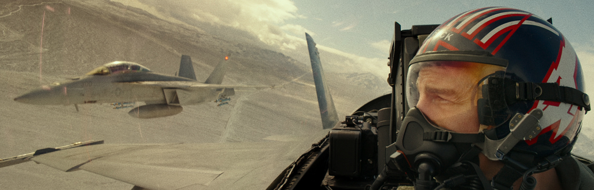

Estaba yo viendo su última película cuando me dio por echarle un vistazo al histórico de peliculotes en los que ha ido participando **Tom Cruise** a lo largo de su vida, y me encontré con que en mi mente creía haber visto **Risky Business  (1983)**, pero en un derrape cerebral la estaba confundiendo en realidad con **Cocktail (1988)**.

Ay amigo, no. Qué bonito es ver estas cosas, que tienen ya sus buenos 40 años, y tener la suerte de no haberlas visto antes. No era la primera película de *Tom Cruise* (me he dejado apartadas *Taps* y *The Outsiders* para volver a verlas dentro de poco), aunque creo que probablemente sí fuera su primer papel protagonista. Y casi, casi era el estreno de **Rebecca De Mornay** (sólo había tenido otro papel anterior en una película de *Coppola*). Qué jovenzuelos.

Pero ojo al tema: un adolescente de instituto se queda sólo en su casa de *niño bien* durante unos días y la lía pardísima, hasta optar por solucionar sus deudas volviéndose un proxeneta y convirtiendo la casa familiar en un prostíbulo para sus compañeros de instituto.

Lo has leído bien. El *shock* que produce ver esta historia en el año 2022 lo hace magnífico. Es que sólo puedo recomendarla.

Y de **Top Gun: Maverick (2022)** qué os voy a contar. Ni el director ni yo sabemos de qué va. Aparentemente hay que realizar una misión ultra secreta en un país desconocido (*#truestory*, no sabemos quién es el enemigo porque queda feo tener enemigos hoy en día), y llaman al abuelo que estaba ya para retirarse para que entrene a una chavalada que nunca ha entrado en combate. A nadie sorprende que el abuelo tenga que acabar cogiendo otro avión para ir a pegar tiros. No tenemos claro qué país misterioso es ese que tiene aviones ultra secretos mejores que los americanos pero por alguna razón no va a entrar en guerra con ellos tras ser bombardeados. Es que todo es un disparate.

Aparece **Jennifer Connelly** por ahí, por el qué dirán si no tenemos un interés romántico, y un **Val Kilmer** muy mayor. Y parece que estoy hablando fatal de la película pero la verdad es que me tuvo entretenido un buen rato con aviones *fium fium* y *ratatatata* y esas cosas del querer. Y tiene una banda sonora fantástica, como si se hubiera rodado en los ochenta (del 86 es la película original y le hubiesen pegado las canciones). Se deja ver pero tienes que saber a lo que vas y dejar antes el cerebro en la mesilla.

Tom Cruise desde 1983 hasta 2022. Ha llovido.
