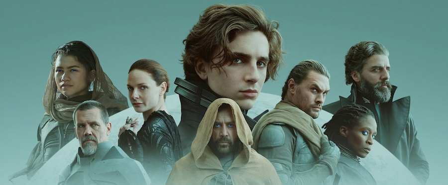
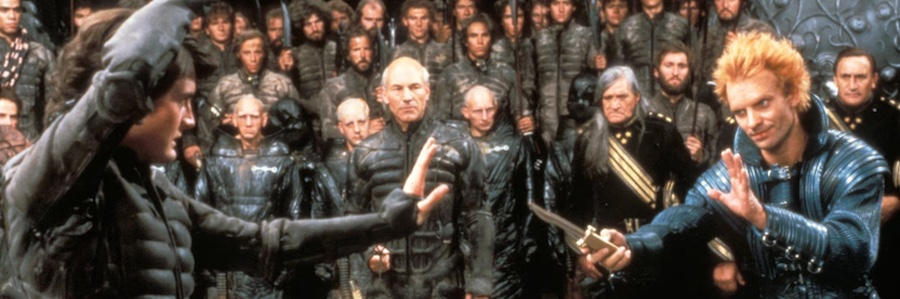
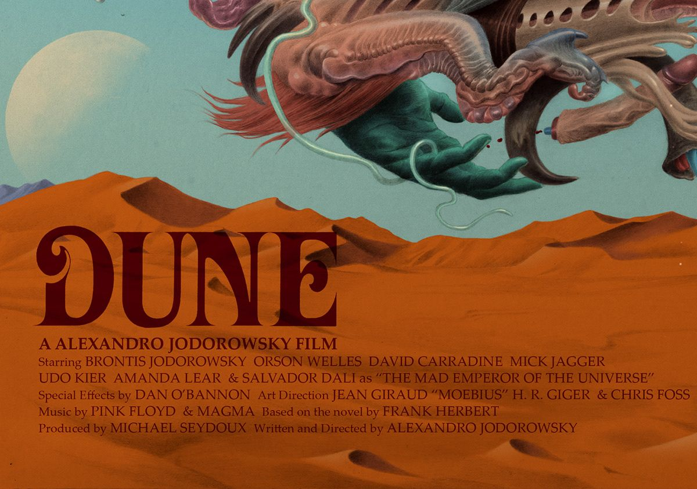

Tengo el libro ahí parado en la estantería, lo que debería darme una cierta verguenza teniendo en cuenta que en su momento comencé un [proyecto de lectura](/los-premios-hugo/) para ir pasando por todos los **Premios Hugo** de novela (je, realista que es uno), y este debería haber sido de los primeros en llamar mi atención... y nunca me he atrevido. Tampoco tenía muchas esperanzas en que esto llegase a alguna adaptación audiovisual... las historias de grandes imperios cuyos planes se miden en siglos requieren efectos visuales de los caros, y no todo el mundo está por la labor. *Apple* se ha metido en el lío con **Fundación**, y en ambos casos ya estamos a la espera de las siguientes entregas (en cine o *streaming*, en película o serie, ya tanto me da una cosa que otra).

Dicen que fue una de las mejores películas del 2021, pero teniendo en cuenta de dónde veníamos y que no se estrenó prácticamente nada en salas, eso y decir nada viene a ser casi lo mismo. Pero si tengo que opinar, que a eso hemos venido, me quedo entre dos aguas. Me ha tenido atrapado durante todo el metraje (y ojo, que no es corta), y a la vez me falta un "algo". Es visualmente espectacular, y a la vez le fallan algunos diseños de producción que no terminan de cuajar del todo. O simplemente le falta un alma que me encaje con lo que yo busco. Tengo la misma sensación que con el **Avatar** de **James Cameron**, que también va a ser continuada en breve... no puedo tener ninguna queja real, de algo palpable, pero algo me dice que no va a crear poso en mi mente y no se va a convertir en un referente en mis mitologías particulares. O quizá espero mucho. Quizá estoy ya tan acostumbrado a sentirme decepcionado con la ciencia-ficción de los últimos años que cuando no tengo de qué quejarme ya no sé cómo reaccionar. Quizá el [**Dune** de **Denis Villeneuve**](https://letterboxd.com/film/dune-2021/) sea un peliculón como la copa de un pino y como poco me ha hecho ir a por el libro a la estantería y ponerlo el primero en la pila de pendientes, para ser el siguiente en leer.

Recordemos que [la vez anterior](https://letterboxd.com/film/dune/) que se intentó hacer una adaptación de Dune, **David Lynch** se vino arriba.

Y recordemos que, [durante un tiempo](https://en.wikipedia.org/wiki/Jodorowsky%27s_Dune), existió la posibilidad de que **Jodorowsky** se hubiese venido incluso más arriba.

Puestos a escoger, creo que tengo poco de lo que quejarme. Qué carajo, sí que tengo algo: la necesidad de crear *películas-franquicia*, de no terminar más que en un gran *continuará* cuando pasarán dos años desde el estreno hasta poder ver la segunda parte. De eso sí me quejo. Ya decía yo que algo tenía que haber.
