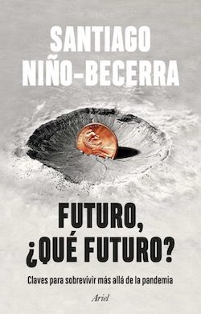

{.left width=40%}

**Futuro, ¿Qué futuro?**
Santiago Niño-Becerra
Editorial Ariel (Planeta), 2022, 256 páginas 

---

Primera lectura del año, con una serie de análisis acerca de la situación actual y próxima por parte del economista [Santiago Niño-Becerra](https://sninobecerra.com/), cuyo nombre ha ido sonando durante la última década tras ser uno de los pocos economistas que "predijeron" la crisis del 2010. 

Esto hay que entrecomillarlo mucho, teniendo en cuenta que "Los Economistas" (*con mayúsculas*) son cada vez más un gremio de pensamiento único en el que es difícil ser una voz discordante o plantear alternativas al Gran Hermano que todo lo sabe. Todos los medios, toda la prensa escrita, todos los libros pontifican los mismos principios una y otra vez, y cuando se vuelve a repetir una de estas crisis internacionales que "*son una cosa que pasa una vez en la vida*" pero llevamos cuatro, niegan la mayor y la única solución sigue siendo seguir como estamos.

Así que se hace difícil ser una voz discordante, decíamos. Todo el mundo te va a mirar raro. Incluso cuando no opinas demasiado sino que das datos que no son difíciles de contrastar, como en la mayor parte del texto. Es lo que hay. Así son las cosas.

Como libro creo que le falta una cierta labor editorial, no hay un hilo conductor que ayude a su lectura y parece más una serie de apuntes desconectados, o una serie de entradas de un blog que, aunque están relacionados temáticamente, te hacen difícil leerlos de seguido... una lectura con "desarrollo" desde unas premisas hasta unas conclusiones se habría hecho más ameno de leer.

Pero de las tesis que trata no puedo tener mucha queja. Un análisis certero de la situación en la que estamos y las razones que nos llevan a ella... y por desgracia un (probablemente acertado) pesimismo en cuanto a los posibles desarrollos futuros. Sé que el autor no llegará jamás hasta este quasi-anónimo blog, pero si algún día lo hace, lo único que le añadiría a esta serie de posibles predicciones sería tener en cuenta el gran factor corrector de asuntos económicos del último siglo: el comienzo de guerras que maquillen los números. Un epílogo acerca de estas opciones sería muy bienvenido.
