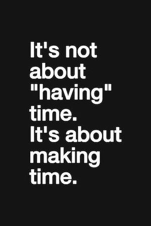

{.right}

Durante el pasado año sucedió algo lamentable y ridículamente inesperado en mi vida adulta, o siquiera desde que tengo uso de razón, y es que creo que a lo largo de todo el año no terminé ningún libro. Reitero el "creo", porque ahora mismo no consigo recordar ningún libro concreto, así que podría estar equivocado. 

Empecé muchos, tengo medio docena a medio leer, otra media docena empezados del año anterior en los que he ido avanzando algunos capítulos aquí y allá... pero 2022 fue un año muy complejo a todos los niveles, en el que la vida personal y profesional me tuvo atrapado hasta el punto de no encontrar apenas ratos sueltos  para dedicárselos a unas páginas, y yéndome a dormir casi cada día derrotado de cansancio, sin ser capaz ni de leer antes de caer dormido. Leí mucho tebeo, pero ese no es el tema.

Es necesario arreglar esto durante el año 2023 y todos los próximos, y remotar el buen hábito de la lectura.

### Enero

- [Futuro, ¿Qué futuro?](./futuro-¿que-futuro/) de Santiago Niño-Becerra.

