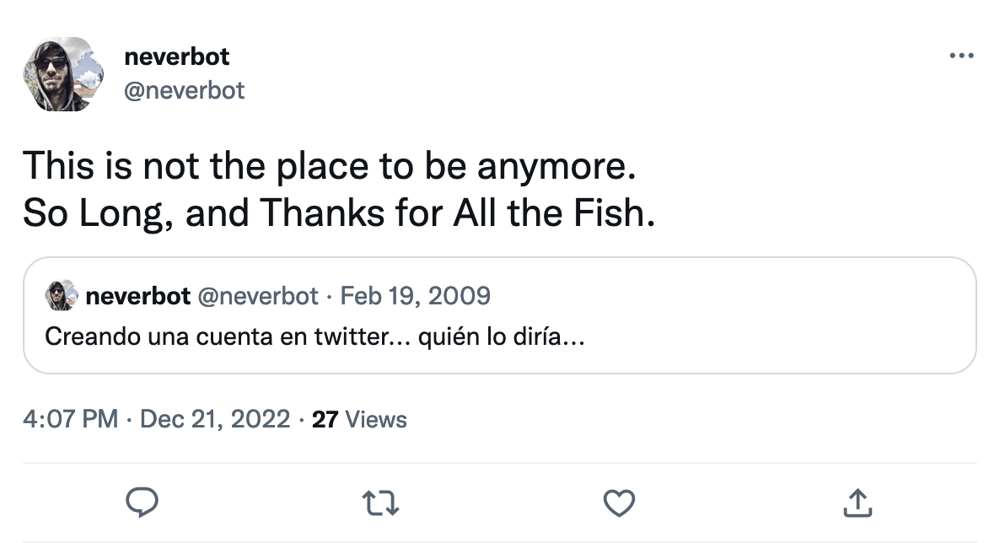

Pues tampoco es algo de lo que sentirse especialmente orgulloso, ni que fueran a darme un premio por ello o algo, pero por dejarlo apuntado: el mes pasado **abandoné Twitter** (que no es que lo utilizara para mucho, pero vaya, ahí estaba la cuenta con contenido de muchos años).

Era una herramienta que ya estaba muy torcida desde hace tiempo, ya la había dejado varias veces y había tenido recaídas intentando volver a encontrarle una utilidad que apenas le veía... pero desde que **Elon Musk** (*a sociopathic union-busting financial engineer* como [lo definió](https://twitter.com/doctorow/status/1291788787555553282) [Cory Doctorow](https://craphound.com/bio/)) se hizo con su dirección, las razones para seguir dándoles el control de nuestras vidas digitales a una panda de sociópatas irresponsables cuyo interés radica únicamente en los dividendos de sus accionistas han ido desapareciendo aún más rápido.

Esa es otra de las razones por las que poco a poco he ido recuperando mi pequeño lugar en internet: **neverbot.com**

Quería mantener la posesión de la cuenta (la existencia y la influencia de **Twitter** es bastante ubicua y podría necesitarla para algo en el futuro, aunque espero que no), pero borrando todos los contenidos posibles: una solución técnica la encontré en **StackOverflow**, que amplié un poco y luego [dejé allí apuntada](https://stackoverflow.com/questions/64863099/deleting-tweets-with-js-console/74878105#74878105) para el siguiente que busque lo mismo que yo. Un poco de código que copiar en la consola de tu navegador y un buen rato de un hipnotizante avance por todo el histórico de tu cuenta mientras vas viendo caer los *tuits* uno tras otro.

[So long, and thanks for all the fish](https://en.wikipedia.org/w/index.php?title=So_Long,_and_Thanks_for_All_the_Fish).
