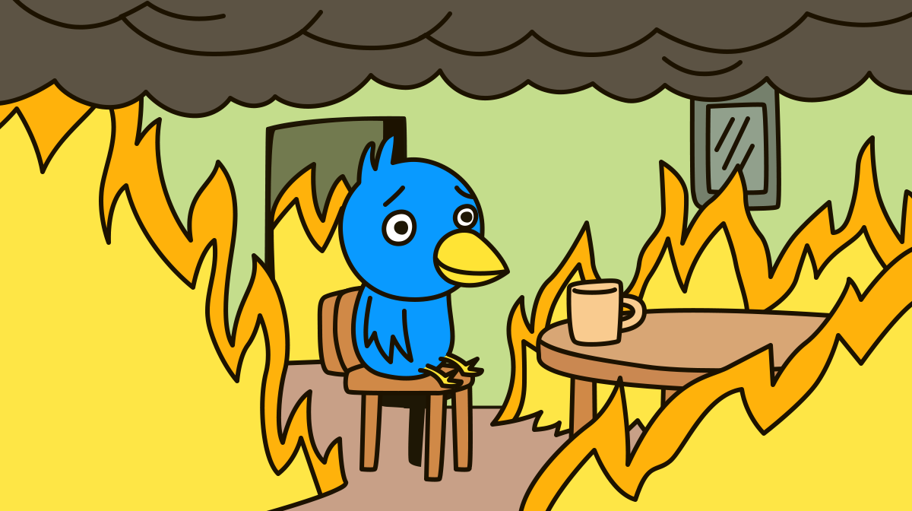
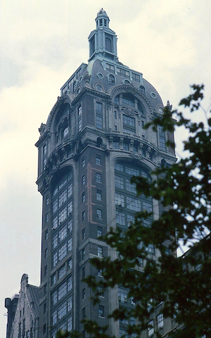

Al hilo del post que escribí acerca de [mi abandono de Twitter](./not-on-twitter-anymore/) (borrado de contenido, si nos ponemos precisos), unas cuentas lecturas interesantes que he ido encontrado de los últimos meses:

- En [Daring Fireball](https://daringfireball.net), **John Gruber** [hablaba en Diciembre](https://daringfireball.net/2022/12/i_wish_i_could_tell_you_this_is_not_all_about_twitter) de cómo el Twitter de **Elon Musk** tomaba decisiones erráticas, como cerrar [Revue](https://www.getrevue.co/) tras comprarla menos de dos años antes, casualmente un día después de que **Jack Dorsey** (co-creador y ex-CEO de Twitter) [comenzase](https://www.getrevue.co/profile/jackjack/issues/a-native-internet-protocol-for-social-media-1503112) allí una *newsletter* hablando de las cosas que habían funcionado mal. La forma en la que se empezaron a eliminar todas las cuentas que incluyeran enlaces a **Mastodon** fue la guinda a un mes interesante.

  

  *[Imagen de IconFactory](https://blog.iconfactory.com/2023/01/state-of-the-twitterverse/)*.{.center}

  Es sorprendente que hayan cerrado **Revue**, teniendo en cuenta que las newsletters están siendo el sustituto de las redes sociales, que fueron el sustituto de los blogs, que fueron el sustituto de los foros, que fueron el sustituto de...

- Esto me recordó un artículo que leí el mes pasado (me costó volver a encontrarlo, no recordaba la web ni el título) acerca de la curva de aprendizaje que tiene administrar comunidades online: [Hey Elon: Let Me Help You Speed Run The Content Moderation Learning Curve](https://www.techdirt.com/2022/11/02/hey-elon-let-me-help-you-speed-run-the-content-moderation-learning-curve/). 

  El recién llegado siempre cree que tiene la fórmula para *solucionar todos los errores* que existen en los demás lugares, olvidando que todos los anteriores ya pasaron por allí, y antes que ellos varias décadas de diseño de juegos online... *nunca contrates a un community manager para hacer el trabajo de un game designer*.

**Curiosidades de otros temas**:

- Imágenes creadas por **Johnny Darrell** con inteligencia artificial de una película que nunca existió: El **Tron** de **Jodorowski** de 1976, [en el New York Times](https://www.nytimes.com/interactive/2023/01/13/opinion/jodorowsky-dune-ai-tron.html).
  
  
  
  Más fáciles de ver (y con más imágenes) [en DjFood](https://www.djfood.org/fantasy-jodorowsky-tron-visualisations-by-johnny-darrell/).

- La teoría de la conspiración chachi de esta semana es: **El Imperio perdido de Tartaria**. [Tartaria](https://en.wikipedia.org/w/index.php?title=Tartary) era el nombre con el que se llamaba entre los siglos XIII y XVIII (*año arriba, año abajo*) a ciertas regiones del Asia central (de ahí "los tártaros"), que en el siglo XIX fue cayendo en desuso conforme la cartografía disponible en Europa era más fiable.

  {.right}
  
  Ya en tiempos modernos, pseudo-historiadores locuelos han inventado un Imperio perdido que es el *verdadero nombre de Rusia*, con (espera que aquí viene lo bueno) edificios en todo el mundo que son vestigios de este gran imperio. En las Guerras Mundiales Tartaria fue destruida y "escondida", deshaciéndonos de la mayor parte de los restos. Por alguna razón hay gente que esto se lo cree, y lo más extraño es que a mí ya ni me sorprende.

  En la foto, el antiguo [Edificio Singer de Nueva York](https://en.wikipedia.org/wiki/Singer_Building) (ya demolido), que *claramente* era una prueba de la existencia del Imperio de Tartaria.
  
  Fantástico [artículo en Never Was Magazine](https://neverwasmag.com/2021/10/lost-empire-of-tartaria/), y [otro en Bloomberg](https://www.bloomberg.com/news/features/2021-04-27/inside-architecture-s-wildest-conspiracy-theory). 
