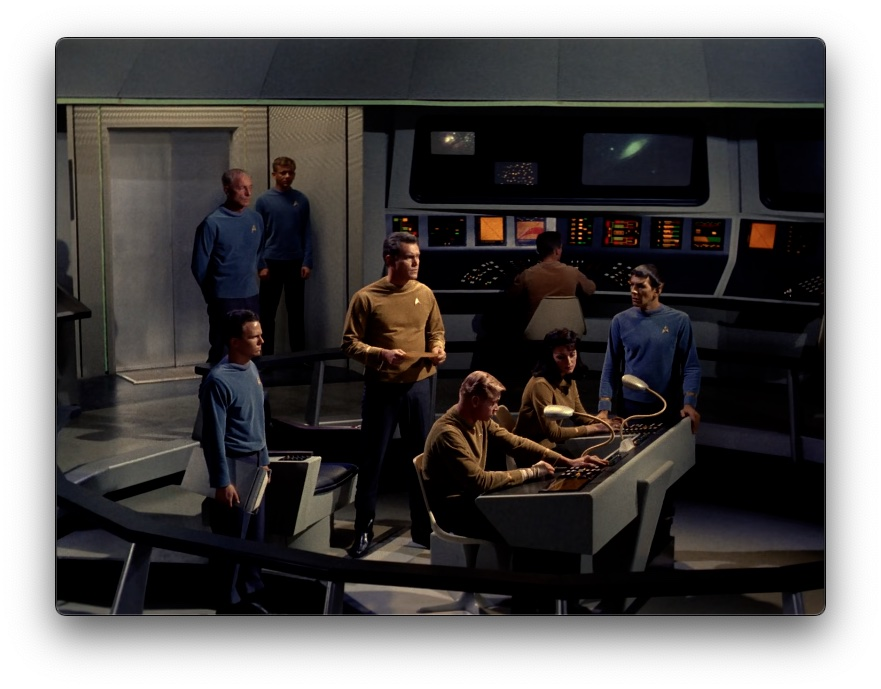
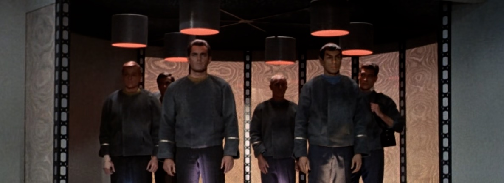

*Este post forma parte de una serie sobre el [revisionado completo de todo Star Trek](/viendo-star-trek-¿como-cuando-y-por-que/), 
es recomendable empezar por ahí*.{.textright}

¿Por dónde comenzar? Por el principio. Si empezamos a ver **Star Trek** desde su origen tenemos que empezar por el primer episodio de la primera temporada de **La Serie Original**, ¿no? 

No. Porque anteriormente a ese comienzo se rodó un primer piloto que estuvo parcialmente perdido durante unos cuantos años (como tantos y tantos [episodios de Doctor Who](https://en.wikipedia.org/wiki/Doctor_Who_missing_episodes)). En 1965 se rodó este piloto, con el título "**The Cage**" como prueba para la NBC, con algunas cosas comunes pero con unas cuantas diferencias.

No teníamos a **William Shatner** haciendo de *Capitán Kirk*, sino a **Jeffrey Hunter** como el Capitán Pike (personaje que un millón de años después sería retomado para aparecer en el *retcon* cinematográfico de **J.J. Abrams** y en la serie **Discovery**). Sí teníamos ya a **Leonard Nimoy** como *Doctor Spock*, de hecho el único actor del elenco que se mantendría después de este piloto, aunque aquí no era el primer oficial. Ese puesto lo tenía la actriz **Majel Barrett** (futura esposa de **Gene Roddenberry**, creador de la franquicia), sin un nombre concreto, sólo *Number One*.

Hay ideas que ya estaban ahí, como un médico que hacía las veces de confesor del capitán (aquí un *cheñor mayor*), la preciosa banda sonora, las naves, los efectos (era un episodo piloto bastante caro para la época, aunque ahora lo veamos tan desfasado, 58 años después), pero a la NBC no le gustó. Quedaron complacidos con el concepto, pero no con el desarrollo, así que pidieron que se volviera a hacer, con un episodio menos "cerebral", con más acción, y cambiando las elecciones de *casting* buscando una mayor química entre los actores. Con esas premisas y con nuevos actores se rodó "**Where no man has gone before**", el nuevo piloto que se mostraría a la NBC, que sería esta vez aprobado y acabaría emitiéndose ordenado como el tercero de la primera temporada.

Sin embargo hay que aprovecharlo todo, que estas cosas son caras de rodar. Así que parte del metraje de "**The Cage**" se utilizó para los episodios 11 y 12 ("**The Menagerie**", partes I & II), pero en el proceso de montaje se dieron por perdidos los originales de este primer piloto. Durante 20 años la única forma que hubo de verlo fue un montaje parcial usando una copia en 16mm en blanco y negro usada por Roddenberry para usar como referencia, intercalado con los minutos a color que sí sobrevivieron al proceso. Quiso el destino que en 1987 un técnico encontrase un rollo en un laboratorio de Hollywood con un negativo en 35mm que tenía una copia del original, que llevó a la oficina de Roddenberry en la Paramount, y a partir de ahí comenzó un proceso de restauración que nos devolvió el piloto perdido que ahora podemos ver como curiosidad previa al comienzo de la serie.

Otros enlaces:

- Artículo sobre el episodio piloto en [Forgotten Trek](https://forgottentrek.com/the-original-series/the-cage-the-star-trek-pilot-that-wasnt-quite/).
- Y en la [Wikipedia](https://en.wikipedia.org/wiki/The_Cage_(Star_Trek:_The_Original_Series)).
