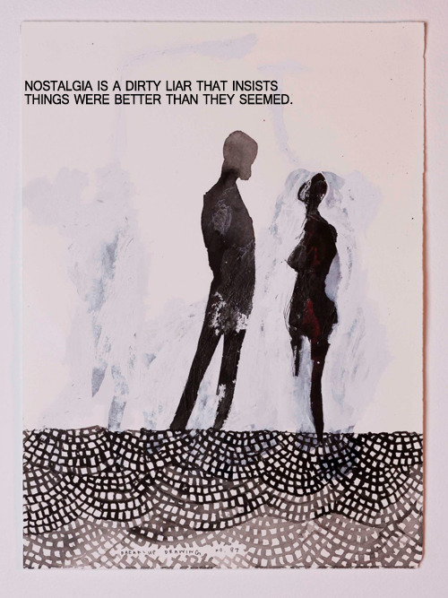
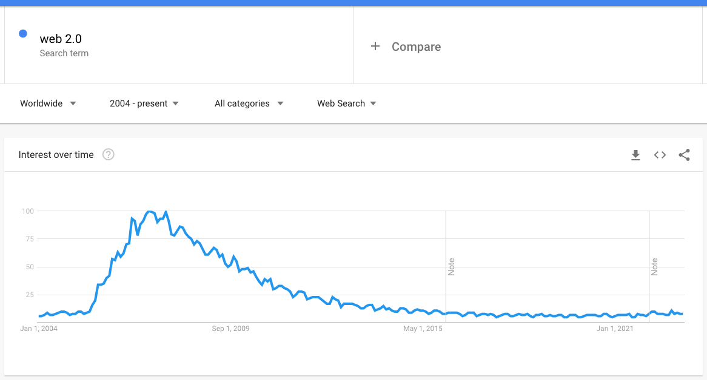
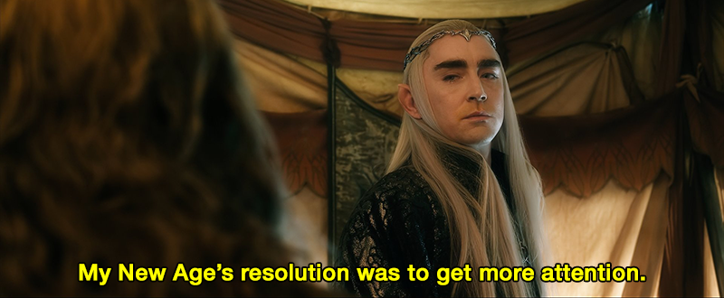

[{.right width=40%}](https://neverbot.tumblr.com/post/153438476493/wiitch-craft-adore-this) Como persona obsesiva que soy, cuando me da un por un asunto cualquiera lo acabo convirtiendo en un vertedero de tiempo mientras busco por internet, investigo, recopilo información y enlaces... para un mes después no recordar nada de lo que he hecho, ya que mi obsesión ya habrá pasado a ser otra. Según apunto décadas en el contador particular, los recuerdos insignificantes permanecen durante menos tiempo. No sé si porque ya no me impresionan tanto como antes, si porque mi obtuso cerebro no funciona en plenitud de funciones, o simplemente porque el número de mitologías privadas que es capaz de almacenar una mente ya ha hecho tope, y las nuevas no entran. 

Así que no me parece una mala idea utilizar este blog como un repositorio de estas ensoñaciones pasajeras y la información que vaya recopilando al respecto. Si lo dejo todo apuntado, hay un doble efecto: por un lado, escribir y desarrollar un texto de un tema cualquiera siempre hace que lo asimiles y recuerdes mejor. Por otro lado, si no surte efecto al menos podré volver a visitar mi propia página y consultar lo que dejé apuntado.

Hace poco leía que lo bueno que tenía la incipiente **Internet 2.0** de los blogs creciendo como setas tras un día de lluvia es que no había una razón económica detrás, y en la mayor parte de ocasiones ni siquiera de atención. Si querías escribir en un rincón de Internet acerca de [bordado en punto de cruz](https://es.wikipedia.org/wiki/Punto_de_cruz), lo hacías. Y si abandonabas la página un año después tampoco pasaba nada, no era un fracaso. Ahí estaba tu esfuerzo para que el siguiente aprendiera, creciendo [a hombros de gigantes](https://en.wikipedia.org/wiki/Standing_on_the_shoulders_of_giants).

[Tendencias históricas del término Web 2.0](https://trends.google.com/trends/explore?date=all&q=web%202.0) según *Google Trends*.{.center}

A lo largo de los años he ido tomando notas de (algunas de) las películas que iba viendo, y últimamente he empezado a hacerlo con algunas series de televisión:

- [Categoría de cine](./tags/cine/) y los posts titulados "*Reseñas cinematográficas relámpago*".
- [Categoría de televisión](https://neverbot.com/tags/tv/) y los posts titulados "*Movidas catódicas*".

Un buen ejercicio sería obligarme a escribir al menos unas líneas sobre todo lo que consumo relacionado con esas categorías que, para mi desgracia, es más de lo que me gustaría admitir.

{.center width=70%}

[🔗](https://neverbot.tumblr.com/post/155298911208) *No es la razón para escribir estas líneas, pero me ha hecho gracia*.{.center}

Pero además de estas pequeñas notas, algo que me gustaría ir haciendo poco a poco es dejar escritas páginas aglutinadoras de múltiples post sobre un mismo tema, para poco a poco ir haciendo que el repositorio de *información temática* vaya siendo lo suficientemente grande.

Por ejemplo, quise empezar a hacerlo con la página [Los Premios Hugo](./los-premios-hugo), donde iba a ir apuntando las reseñas de cada novela premiada que me leyera pero, para mi escarnio y vergüenza, no pasó de una primera entrada cuando leí [Pórtico](./portico-de-frederik-pohl/), y no volví a actualizarlo. Pero eso es lo que quiero hacer a partir de ahora, ir tomando notas poco a poco sobre algunos de los "*grandes proyectos para el blog*" en los que estoy o tengo idea de estar:

- Lectura de todas las [novelas premiadas con el Premio Hugo](./los-premios-hugo/).
- Revisionado de [**Smallville**](https://thetvdb.com/series/smallville) siguiendo [el Podcast Talk Ville](https://www.youtube.com/@talkvillepodcast) que están haciendo **Michael Rosenbaum** y **Tom Welling** (acaba de empezar su revisionado la segunda temporada cuando escribo estas líneas, yo por ahora he visto unos pocos de la primera). Ver el capítulo y luego escuchar su *podcast* me parece la forma idónea de acometer esto.
- He comenzado ya con la serie sobre el [revisionado de todo **Star Trek**](./viendo-star-trek-¿como-cuando-y-por-que/) (*estamos locos*) y el primer post que continúa el texto de la página, sobre [el primer episodio piloto de la serie](./star-trek-el-episodio-piloto-perdido/), perdido durante dos décadas.
- En mi ánimo nostálgico por regresar a las cosas que me proporcionaron felicidad, también volví a comenzar [**Expediente-X**](https://thetvdb.com/series/the-x-files), y sigo con la fantasía recurrente de que volver a ver [**Perdidos**](https://thetvdb.com/series/lost) más de una década después de que terminase quizá fuese algo interesante que hacer. Me da miedo, pero serían dos temas interesantes sobre los que ir escribiendo posts conforme avanzase.
- Veo bastante **Anime**, y creo que es algo de lo que apenas he hablado por aquí en alguna ocasión. Pero con tantas series tan parecidas unas a otras, tanto *Isekai*, desde el final de una temporada hasta el comienzo de la siguiente pasa tanto tiempo que empiezo a mezclar personajes y tramas, y quizá debería hacer lo mismo y dejar apuntados algunos resúmenes... porque he tenido que volver a empezar desde el principio [**Overlord**](https://thetvdb.com/series/overlord), [**Danmachi**](https://thetvdb.com/series/is-it-wrong-to-try-to-pick-up-girls-in-a-dungeon) o [**Re:Zero**](https://thetvdb.com/series/re-zero-starting-life-in-another-world) porque en mi mente todas son la misma serie.

¿Saldrá algo de todas estas ideas de "*voy a...*", "*voy a...*"? Pronto lo sabremos, en el mismo *bat-canal* a la misma *bat-hora* de siempre.